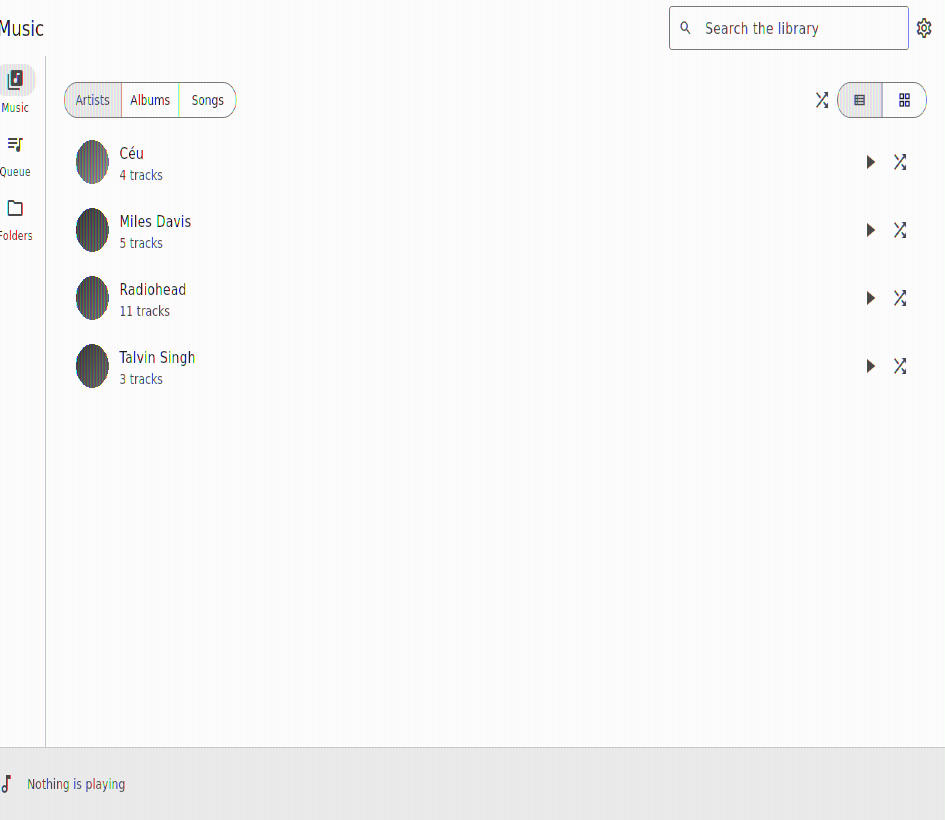
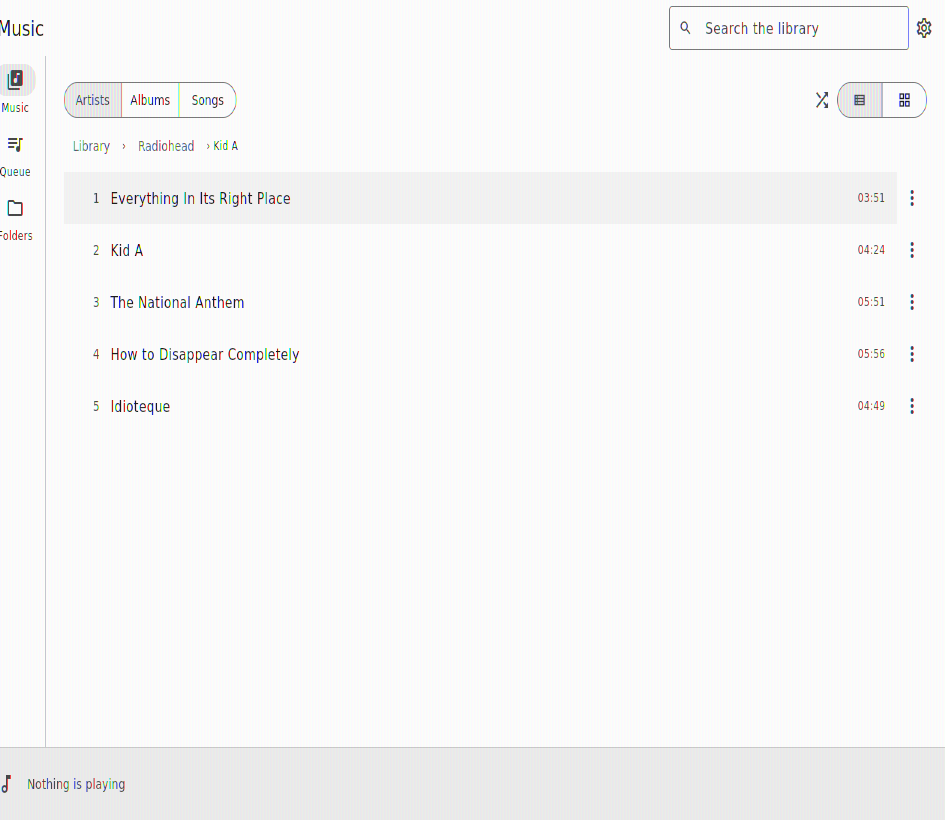

# Orpheus

A music player for Windows, Linux and Android. It reads the audio files already
on the machine it is running on, names every track by its tags rather than by
its file name, and plays them — with the same interface on all three platforms.

It is the music half of [Alexandria](https://github.com/artur-rios/alexandria-ui)
taken out on its own: the same browsing area, the same persistent playback bar,
the same full-window player. What changed is what stands behind it. Alexandria
reads its catalog from a Rust core over FFI; Orpheus has no core and no server.
It walks the folders it is pointed at, reads the tags itself, and keeps the
result in a file beside its own settings.

> **Status:** complete and tested. 354 unit and widget tests; `flutter analyze`
> clean. Every use case in the [specifications](#specifications) is implemented
> — see the [roadmap](#roadmap). All three release builds and the Windows
> installer are produced and verified by CI on every push. Verified *running*
> on Linux only; Windows and Android build but have not been launched on a
> machine or a device.

## What it does

- **Reads a library from folders you choose.** Register one or more folders and
  Orpheus walks them, reads the tags out of every audio file, and pulls out the
  cover art. Nothing is indexed that you did not point it at.
- **Browses by artist, album and song**, in rows or as a wall of sleeves, with a
  breadcrumb back out of whatever you drilled into.
- **Plays a track, a record, an artist, or everything shuffled**, with a queue
  you can see and jump around in, repeat, and a resume point per track.
- **Shows what is playing everywhere** — a persistent bar across the bottom, and
  a full player with the record's own sleeve as large as the window allows.
- **Draws the music itself.** The bars on the player are the spectrum of the
  recording, measured from its own samples by the same engine that plays it,
  analysed once per track and kept.
- **Keeps playing on Android once you switch away**, from a notification and the
  lock screen that carry the sleeve and the transport buttons — and stops for a
  phone call, and for headphones pulled out of the socket.
- **Shows the words, in time with the music**, where your own files carry
  them — a `.lrc` beside the track, or the track's own lyrics tag. The line
  being sung is lit, the sheet scrolls itself, and tapping a line plays from
  there.
- **Searches** across titles, artists and albums, ranked so a match at the start
  of a title comes above one buried in the middle of something else.
- **Says what you actually listen to** — total plays, and the most played
  tracks, artists, records and genres, counted from your own listening and
  nobody else's.
- **Adapts to the window**: a rail down the side on a desktop, a bar across the
  bottom on a phone, and the same rules at every width in between.
- **Light and dark, English and Brazilian Portuguese.**

## What it doesn't do

- **It never writes to your music.** No tag editing, no renaming, no moving, no
  deleting, no transcoding. It opens files for reading and that is all.
- **No network of anything.** No streaming, no scrobbling, no metadata lookup,
  no cover art fetched from the internet. The Android package asks for no
  `INTERNET` permission, which is the version of this promise a machine can
  check.
- **No accounts, no sync, no cloud.** One person, one machine, one library.

## Specifications

The project is specified before it is built. Start with the `initial/`
documents for context, then the `requirements/` documents for the normative
detail.

| Document | What's in it |
| --- | --- |
| [Brainstorm](docs/initial/Brainstorm.md) | The original free-form notes this project grew from. |
| [Project Overview](docs/initial/Project%20Overview.md) | What it is, who it's for, and how success is measured. |
| [Technology Stack](docs/initial/Technology%20Stack.md) | The informal stack decisions and the reasoning behind them. |
| [Workflow](docs/initial/Workflow.md) | How one use case is delivered, step by step. |
| [Business Rules](docs/initial/Business%20Rules.md) | The domain entities and the `BR-xx` rules. |
| [Vision Document](docs/requirements/Vision%20Document.md) | Stakeholders, positioning, and the `F-xx` features. |
| [System Requirements Document](docs/requirements/System%20Requirements%20Document.md) | The `FR-<AREA>-xx` and `NFR-xx` requirements, the data model, and traceability. |
| [Use Case Specification Document](docs/requirements/Use%20Case%20Specification%20Document.md) | The `UC-xx` use cases, their flows, and their `AF-xx` alternatives. |
| [Development Workflow Document](docs/requirements/Development%20Workflow%20Document.md) | The normative branch pattern, issue lifecycle, and Definition of Done. |
| [Testing Specification Document](docs/requirements/Testing%20Specification%20Document.md) | How tests are written, named, and run. |
| [Technology Stack Document](docs/requirements/Technology%20Stack%20Document.md) | The single source of truth for every technology and version. |
| [Operations & Infrastructure Document](docs/requirements/Operations%20%26%20Infrastructure%20Document.md) | Layout, storage, startup, permissions, logging, and the `IR-xx` requirements. |

## Screenshots

The library, and a record opened inside it:

| Artists | Inside a record |
| --- | --- |
|  |  |

## Installing and running

Orpheus is a Flutter application. There are no published packages yet; build it
from source.

```bash
flutter pub get
flutter run -d linux      # or -d windows, or a connected Android device
```

If you are going to change the code rather than just run it, use
[`tools/dev.sh`](#running-it-while-you-work-on-it) instead — it picks the
device, checks what the platform needs, and can reset the application to a
first launch.

**Linux** additionally needs libmpv at runtime — the playback engine is
media_kit, which is libmpv-backed:

```bash
sudo apt install libmpv-dev mpv     # Debian and Ubuntu
```

**Android** needs no extra dependency; the engine ships inside the package. The
minimum supported release is Android 7 (API 24) — read back out of the built
package rather than asserted, and set by the plugins rather than by the engine.

**Windows** needs no extra dependency either — the engine's DLLs are bundled by
`media_kit_libs_audio`. For a Windows machine you would rather not build on,
`tools\build-windows-installer.ps1` produces a normal setup executable —
see [The Windows installer](#the-windows-installer).

### First run

The library starts empty and stays empty until you point it somewhere. Open
**Folders**, add the folder your music is in — or press **Add my music folder**,
which offers the platform's conventional one — and the scan starts. On Android
the system asks for permission to read audio files at that point; it is asked
for once you have registered a folder, never before. Android also asks to be
allowed to post the playback notification, and that one is asked for the first
time you press play. Refusing it costs the notification and nothing else —
playback still runs, and still runs in the background.

## How it works

Eight things happen, and they are worth reading in this order.

**A scan walks the folders and reads the tags.** It runs on an isolate of its
own, because it is the whole of the expensive half of this application: a walk
of every path under the library folders and a parse of every audio file among
them. Progress is reported from a strip above the playback bar, and the library
already on screen stays usable while it runs.
(`features/library/data/scan_worker.dart`)

**Tags are read in pure Dart** — `audio_metadata_reader`, covering ID3, Vorbis
comments, iTunes atoms, RIFF and APE. Pure Dart matters here: it is the one
component that would otherwise need a native build per target, and a reader that
cannot run in a test is a reader whose parsing nobody checks.
(`features/library/data/tag_reading.dart`)

**Cover art is extracted once, at scan time, and stored by content.** The id of
a picture is a hash of its bytes, so the twelve tracks of a record that each
carry the same JPEG store it once — which keeps the cache proportional to the
number of records rather than the number of files. A record with no embedded art
but a `cover.jpg` beside it uses that instead.
(`features/library/domain/cover_store.dart`)

**Whose record a track is on is worked out across the record, not per file.**
Several common tag formats have no album-artist field at all, and half-tagged
libraries are the norm — so a rap record whose tracks credit a different guest
each time is one artist rather than twelve. One track carrying the tag settles
the record; with no tag anywhere, the performer most of the record's tracks name
is taken as its artist. That last rule is a judgement, and it is documented as
one where it lives. (`features/library/domain/music_grouping.dart`)

**The catalog is a single JSON document, written atomically.** It is read back at
launch so a start is fast, and re-scanned behind the interface: a file still on
disk at the same size and timestamp is carried over rather than re-parsed, which
is what makes re-scanning an unchanged library cheap enough to do at every
launch. Encoding and decoding it happen on an isolate, not on the interface's:
on a large library the document is megabytes, and parsing it is the one piece of
startup work that would otherwise land on the thread drawing the first screen.
It is rewritten only when the scan actually added or removed something — a scan
that changed nothing would encode the file that is already on disk.
(`features/library/data/json_catalog_store.dart`)

**The scan at startup trusts folder timestamps; the one you ask for does not.**
A folder whose own timestamp predates the last scan has had nothing added to it,
removed from it or renamed inside it, so its tracks are taken from the catalog
instead of being `stat`ed one by one — on a library of eleven thousand tracks
that is eleven thousand system calls a launch does not make. What it cannot see
is a file rewritten in place, which changes the file's timestamp and not its
folder's, so **Scan now** on the library screen still stats everything.
(`features/library/data/scan_worker.dart`)

**The player outlives the screen that started it.** The queue and the engine
live in a controller; the bar and the full player are views of it. A file that
is missing or will not decode is named, stepped over, and the queue carries on;
when the queue runs out of tracks to try, it says so.
(`features/playback/application/audio_playback_controller.dart`)

**On Android the notification is the background playback.** A foreground
service is the only way the system lets a process keep making noise once it is
no longer on screen, and the notification is what a foreground service is
obliged to post — so the two are one thing rather than a feature and its
decoration. The session behind it is a third view of the same player, alongside
the bar and the full player: it shows what is playing and it sends back what was
pressed, and it holds no queue of its own. What comes back through it is not
only the transport buttons — a phone call arriving and a pair of headphones
leaving the socket arrive as the same ask, which is why the player never learns
the difference between them. On Windows and Linux the same seam is bound to a
session that shows nothing, which is why none of the code above it has a
platform check in it.
(`features/playback/domain/media_session.dart`)

**A play is counted at half the track, or four minutes.** The convention
scrobblers have used for twenty years, and it is the right shape in both
directions: a two-minute song abandoned after forty seconds was not listened
to, and an hour-long live set does not stop counting because you left before
the encore. The counter resets when a track *opens* rather than when the track
changes, which is what makes a song left on repeat worth a play each time
round. The rankings themselves are never stored — they are worked out by
reading the play history against the catalog, so re-tagging a library corrects
its history instead of leaving the old names ranked forever.
(`features/stats/domain/play_threshold.dart`)

### The sound bars

The moving bars on the player screen are the **real spectrum of the recording**,
measured from its own samples. The engine reports a position and nothing about
the waveform behind it, so the track is analysed separately: the same libmpv
that plays it is told to decode it to mono at 16 kHz and write it to a scratch
file as fast as it can, and a windowed Fourier transform over that gives sixteen
logarithmically spaced bands, about thirty rows a second, levelled against the
track's own loudest moment so a quietly mastered record still moves. A
four-minute track takes about a second to analyse and a hundred kilobytes to
keep, and it is kept — cached beside the covers under a key that carries the
file's length and modification time, so a track is analysed once and a re-rip of
it is analysed again.

Using the playback engine as the decoder is what makes this work everywhere:
whatever Orpheus can play, it can analyse, on all three platforms, with no
second codec library and no format that plays but does not draw.

The analysis runs off the interface's isolate and does not hold up playback, so
there is a second on first play before it lands. Until it does — and for a file
that could not be decoded at all — the bars fall back to a **stand-in**
synthesised from the track's identity: deterministic (the same second of the
same track draws the same bars every time) and distinct (two tracks move
differently). It is a sign that something is playing rather than an analysis,
and the code says so where it is defined.
(`features/playback/domain/track_energy.dart`,
`features/playback/domain/audio_spectrum.dart`,
`features/playback/data/mpv_track_analysis.dart`)

### The words

Synced lyrics come from the machine the music is on, because there is nowhere
else for them to come from here. Three places are looked in, in this order: an
`.lrc` file beside the track and named after it; the track's `SYLT` frame; and
the track's lyrics text tag — `USLT` in an MP3, `©lyr` in an MP4, `LYRICS` in a
Vorbis comment or an APE tag. The sidecar wins over both, because it is the one
of the three an owner can write, correct or delete with a text editor and no
help from this application.

`SYLT` comes next because it is the frame that actually carries times: a moment
and a piece of text, held as structure rather than as text somebody hoped a
player would parse. The tag-reading package used everywhere else here surfaces
`USLT` — the frame that by definition has no times in it — and stops, so the ID3
tag is walked directly for `SYLT` before the text frame is consulted. It is a
header read: the tag's own first ten bytes say how long it is, exactly that much
is read, and the audio behind it is never touched. ID3v2.2 through v2.4, the
four text encodings, unsynchronisation whole or per frame, an extended header
and a data-length indicator are all covered, because real files carry all of
them. A frame that is compressed, encrypted, carrying something other than words
— the format allows chords and trivia in the same frame — or timed in MPEG
frames rather than milliseconds is declined, and the text frame answers instead.

The sidecar and the text frames are read with one LRC reader, since a lyrics tag
very often holds LRC pasted into it. It takes the parts of that format real
files actually use: the `[ti:]`-style header, several times on one line for a
refrain, `[offset:]`, and the per-word times of enhanced LRC, which are dropped
because this lights a line at a time. A file with no times in it at all is read
as a plain sheet and said to be one, rather than rejected or given invented
times — nothing here guesses when a line is sung.

On the player the words take the sleeve's place rather than sitting under it —
both want the same room — the line being sung is lit and brought into view by
itself, tapping a line plays from there, and the panel leaves you where you
scrolled to for a few seconds so that reading ahead is possible.
(`features/lyrics/data/lrc_parsing.dart`,
`features/lyrics/data/id3_synced_lyrics.dart`,
`features/lyrics/data/file_lyrics_source.dart`,
`features/lyrics/domain/lyrics.dart`)

## Layout

```
lib/
  core/            themes, spacing, breakpoints, settings, failures, l10n,
                   and the single composition root in core/di/providers.dart
  features/
    library/       folders, scanning, tags, cover and catalog storage
    playback/      the queue, the engine and media-session boundaries, and
                   the music area
    lyrics/        finding a track's words on this machine, and reading along
    stats/         the play threshold, the history, and the rankings
    shell/         the frame: navigation, the playback bar, preferences

tools/             dev.sh / dev.ps1 to run it, verify.sh / verify.ps1 to
                   check it, and the Windows installer build
packaging/windows/ the Inno Setup script the installer is compiled from
packaging/icon/    the application icon, and the script that draws it
```

Each feature is `domain` (no Flutter, no IO), `data` (the outward edges),
`application` (the controllers), `presentation` (the widgets). Nothing outward
is constructed anywhere but `core/di/providers.dart`, which is what lets a test
override a binding rather than patching a global.

## Building and testing

```bash
flutter analyze              # must be clean; there is no known-warnings list
flutter test                 # 354 unit and widget tests
flutter build linux --release
flutter build windows --release
flutter build apk --release
```

### Running it while you work on it

```bash
./tools/dev.sh               # Linux and macOS
.\tools\dev.ps1              # Windows
```

Picks a device, checks what it needs, and starts the application. With no
arguments it runs on this host's desktop; with one device attached and no
desktop target, on that one; with several, it refuses and lists them rather
than guessing — being handed a phone when you meant the desktop costs more time
than typing `--device`.

**The loop is Flutter's own.** While it runs, `r` hot-reloads, `R` hot-restarts,
`q` quits — so *change the code and see it* is one keystroke, not another run of
the script. Start it again for the things hot reload cannot carry: a new
dependency, a native or platform file, or a change to either `.arb` catalog
(then use `--generate`).

| Flag | |
| --- | --- |
| `--device ID` / `--android` | Where to run. `--android` takes the attached device or emulator, whatever its id. |
| `--clean` | Delete this application's own data — the catalog, cover cache, analysed spectra, play history and preferences — so the next start is a first launch. **Never touches your music**, names exactly what it will delete, and asks first unless `--yes`. On Android it clears the app's data on the device. |
| `--generate` | Regenerate the localizations first. |
| `--test` | Run the suite first, and stop if it is red. |
| `--profile` / `--release` | Run the way an owner would get it. Neither has hot reload — that is debug only, and the script says so rather than letting you press `r` into silence. |
| `--no-run` | Do everything else and stop. |

On Linux it also checks for libmpv up front, because without it playback fails
at the first press of play rather than at startup — which is a long way from the
cause.

On Windows the first build in a fresh build directory prints `Nuget.exe not
found, trying to download or use cached version.` That is CMake, not this
application: `permission_handler_windows` compiles against the CppWinRT NuGet
package and fetches a pinned, checksummed `nuget.exe` when one is not on `PATH`.
It is a status line rather than a warning — a real failure stops the build with
`Failed to install nuget package Microsoft.Windows.CppWinRT` — and it prints
once per clean build directory. `winget install Microsoft.NuGet` silences it.
The plugin itself does nothing on Windows; it arrives as the endorsed Windows
implementation of the `permission_handler` that Android needs, and Flutter
builds every plugin registered for a platform whether or not it is used.

`tools/dev.ps1` takes the same flags in long form (`-Device`, `-Clean`, `-Yes`).

### The icon

The application icon is a lyre — Orpheus's own instrument — whose strings are
the sound bars from the player screen, standing at the uneven heights a level
meter stands at.

It is **drawn in code**, not kept as a binary nobody can edit: a change to the
palette, the proportions or the string heights is a diff in one Python file,
and every size every platform wants is regenerated from it.

```bash
python3 packaging/icon/make_icon.py     # needs Pillow, and nothing else
```

That writes the Android launcher icons at all five densities — the square one
for releases before Android 8, and the adaptive icon's foreground layer, drawn
without its background so the launcher can mask the pair into whatever shape
the device uses — the Windows `.ico`, the Linux window icon, and the 1024px
master in `packaging/icon/`.

The two smallest `.ico` frames are drawn from **separate, simpler artwork**.
At sixteen and thirty-two pixels the arms and the yoke are a stroke under two
pixels wide, which is not a lyre, it is grey fringing; what those frames show
instead is what the mark is about — three bars at three heights on their
soundbox. An `.ico` saved from one image is that image downsampled six times,
and the two smallest of those are the mush this avoids.

Flutter's Linux runner ships no icon at all, so `linux/CMakeLists.txt` installs
the PNG beside the bundle's data and `my_application.cc` loads it into the
window. Beside the bundle rather than into a `hicolor` theme deliberately: this
is the icon of the window this binary opens, which is a different thing from
the icon a packaged application registers with the desktop, and only the first
is the build's to decide.

### Verifying everything at once

```bash
./tools/verify.sh            # Linux and macOS
.\tools\verify.ps1           # Windows
```

Each runs the analyzer, the suite, and a release build of every target its host
can build — then prints one summary saying what passed, what was skipped, and
what this operating system could never have done in the first place.

That last distinction is the point of the script. **No single machine can build
all three targets**: Windows binaries need Windows and MSVC, Linux binaries need
Linux and GTK. So a run reports three outcomes rather than two —

| | Meaning | Under `--strict` |
| --- | --- | --- |
| `PASS` | It ran and it passed. | passes |
| `SKIP` | A toolchain that could have been here was not — no Android SDK, no `libgtk-3-dev`. | **fails** |
| `n/a` | This operating system cannot build that target at all. | passes |

— because a missing Android SDK is something you can fix, and a Linux machine
not producing a Windows binary is not.

Useful flags: `--no-build` for the fast loop, `--only linux|android|windows` for
one target, `--strict` for CI. `tools/verify.ps1` takes the same ones in long
form, plus `-Installer`.

`.github/workflows/verify.yml` is what makes the `n/a` rows add up to nothing: it
runs `verify.sh --strict` on Linux (Linux + Android) and `verify.ps1 -Strict` on
Windows (Windows + the installer). It also reads the built APK's permissions back
out and **fails the build if `INTERNET` ever appears in it** — which is the
promise at the top of this file, enforced rather than asserted.

### The Windows installer

```powershell
.\tools\build-windows-installer.ps1
```

Builds the Windows release and compiles `packaging\windows\installer.iss` into
`dist\orpheus-setup-<version>.exe`. It needs [Inno Setup](https://jrsoftware.org/isdl.php)
(`winget install JRSoftware.InnoSetup`); the script looks for `ISCC.exe` on
`PATH` and in both standard install directories, and takes `-InnoSetupPath` if
it is somewhere else. `-SkipBuild` reuses an existing release build.

The installer offers a per-machine or per-user install, an optional desktop
icon, and both languages the application ships. Upgrading over an existing
installation removes the old one first — including one left in a different
directory, if you moved it — and the removal is targeted at the files this
payload writes rather than being a wipe of a directory you chose by hand.

**Your library, catalog, statistics and settings are never touched by
installing, upgrading or uninstalling.** They live in the application-support
directory; an uninstall is not a request to forget what you listened to.

The installer is **unsigned**. SmartScreen will warn on first run until the
project holds a code-signing certificate, which it does not.

Every push builds it: the `Verify` workflow's Windows job uploads
`orpheus-setup-<version>.exe` as an artifact, so the latest one is a download
away from the run that produced it.

Tests are named Given-When-Then, one behaviour apiece, and follow the source
tree: `lib/x/y.dart` is tested by `test/x/y_test.dart`. Nothing in the suite
reads the developer's own preferences, writes into their application-support
folder, records against their listening statistics, opens the native playback
engine, starts a platform media service, or reaches the network — every one of
those is a provider, and every one is overridden by the harness in
`test/support/test_container.dart`.

Two of the tests are guards rather than assertions about behaviour, and they
exist because a rule nobody checks is a comment:

- `test/core/theme/no_colour_literal_test.dart` — every colour comes from the
  theme's single seed, and nothing outside `lib/core/theme/` may declare one.
- `test/core/l10n/catalog_parity_test.dart` — both languages stay complete, every
  message carries a description, and a translation uses the same placeholders as
  its original.

The scanner and the tag reader are tested against real files in a temporary
directory, built by `test/support/flac_fixture.dart` — a genuine FLAC header
with real Vorbis comments and a real embedded picture, small enough to write
from a test.

## Known limits

- **The Android media session is written and built, but unrun on a device.**
  The foreground service, the notification, the lock screen controls and the
  audio-focus handling are all there and are covered by tests against a stand-in
  session; what no test on a build machine can tell you is how the real one
  behaves on real hardware. It is the part of this application most in need of a
  phone.
- **No media session on Windows or Linux.** Neither desktop gets transport keys
  or a system now-playing panel. The seam that would carry them exists and is
  bound to a session that shows nothing, so this is an implementation to write
  rather than a design to change.
- **Lyrics are read, never fetched or written.** A track whose words are on
  neither side of it — no `.lrc`, no `SYLT`, no lyrics text tag — shows a panel
  that says so and says where words would have to come from. Nothing is
  corrected, re-timed or saved back, and a `SYLT` frame whose times are counted
  in MPEG frames rather than milliseconds is declined rather than approximated:
  turning those into a position needs the frame rate of the audio behind them,
  and this reads headers, not streams.
- **No playlists.** Queues are built from a track, a record, an artist, or the
  whole library shuffled. There is nothing to save and name yet.
- **The statistics are all-time, with no windows.** "This month" is a control, a
  parameter, and a second set of numbers to explain, and none of it is worth
  adding before anyone has read the first set. The history stores a count per
  file rather than a row per play, which is what keeps it proportional to the
  number of tracks ever played — and which is what a time window would have to
  undo.
- **The rankings are only as good as the tags.** A library where the same artist
  is spelled two ways ranks as two artists, and nothing here can tell that from
  two artists who really exist.
- **A track is identified by its path.** Move a file and it is a different track
  to this application, and its resume point does not follow it. Re-scanning is
  what reconciles that.
- **Album artist for MP4, Vorbis and RIFF tags is derived rather than read.**
  Those formats' readers here do not surface a distinct album-artist field, so
  the across-the-record derivation described above is what answers for them. For
  an ordinary record it gives the same answer; a various-artists compilation with
  no album-artist tag anywhere lands under whichever performer has the most
  tracks on it.
- **The Windows installer is built but never installed.** CI compiles
  `packaging/windows/installer.iss` on a Windows runner on every push, so the
  setup executable is known to build and to carry the whole payload. What nobody
  has done is *run* it — install, upgrade over an older install, and uninstall
  are specified and reviewed but unexercised. The upgrade path in its `[Code]`
  section is the part most worth someone's attention.
- **Windows and Android build but are unrun.** Both release packages are
  produced by CI from this source, and the Android package's permissions are
  read back out of the built APK rather than asserted. Neither has been launched
  on a machine or a device.

## Roadmap

Nine milestones covering thirty-three issues: one foundation issue plus one
issue per use case. Milestones are dependency-ordered — no milestone depends on a later
one, and every milestone after `M-01` depends on it.

The live view is the [project board](https://github.com/users/artur-rios/projects/13)
and GitHub's own milestone pages; the counts here are as of the last update to
this file.

| Milestone | Delivers | Depends on | Issues | Status |
| --- | --- | --- | --- | --- |
| [M-01 — Foundation](https://github.com/artur-rios/orpheus/milestone/1) | The project scaffold, the layering, the composition root, and the cross-cutting infrastructure every use case is built on (IR-01 … IR-28) | — | 1 | 1 / 1 closed |
| [M-02 — Shell and preferences](https://github.com/artur-rios/orpheus/milestone/2) | A window the owner can open, navigate, theme and translate, with preferences that apply immediately and persist | M-01 | 2 | 2 / 2 closed |
| [M-03 — Library sources and scanning](https://github.com/artur-rios/orpheus/milestone/3) | Folders can be registered, permitted, scanned, reviewed and unregistered — the catalog gets its content | M-02 | 6 | 6 / 6 closed |
| [M-04 — Browsing and search](https://github.com/artur-rios/orpheus/milestone/4) | The library can be browsed by artist, record and song, laid out two ways, and searched | M-03 | 6 | 6 / 6 closed |
| [M-05 — Playback](https://github.com/artur-rios/orpheus/milestone/5) | A track, a record, an artist or the whole library can be played, with a queue, repeat, resume, and a player that survives a bad file | M-04 | 11 | 11 / 11 closed |
| [M-06 — Background playback](https://github.com/artur-rios/orpheus/milestone/6) | Playback continues on Android once the application is off screen, controllable from the notification, the lock screen and a headset | M-05 | 2 | 2 / 2 closed |
| [M-07 — Listening statistics](https://github.com/artur-rios/orpheus/milestone/7) | Plays are counted from the owner's own listening and presented as totals and four rankings | M-05 | 2 | 2 / 2 closed |
| [M-08 — Lyrics](https://github.com/artur-rios/orpheus/milestone/8) | The words of what is playing, read from the machine the music is on, following the music where the file carries times | M-05 | 2 | 0 / 2 closed |
| [M-09 — Sound bars](https://github.com/artur-rios/orpheus/milestone/9) | The spectrum of the recording being played, measured from its own samples, cached per track, with a stand-in until it lands | M-05 | 1 | 1 / 1 closed |

## Backlog

### M-01 — Foundation

| Issue | Work | Spec |
| --- | --- | --- |
| [#1](https://github.com/artur-rios/orpheus/issues/1) | Project scaffold and cross-cutting infrastructure (IR-01 … IR-28) — done | [Operations & Infrastructure](docs/requirements/Operations%20%26%20Infrastructure%20Document.md) |

### M-02 — Shell and preferences

| Issue | Work | Spec |
| --- | --- | --- |
| [#2](https://github.com/artur-rios/orpheus/issues/2) | UC-28 — Navigate the application shell — done | [Use Case Specification](docs/requirements/Use%20Case%20Specification%20Document.md) |
| [#3](https://github.com/artur-rios/orpheus/issues/3) | UC-29 — Manage preferences — done | [Use Case Specification](docs/requirements/Use%20Case%20Specification%20Document.md) |

### M-03 — Library sources and scanning

| Issue | Work | Spec |
| --- | --- | --- |
| [#4](https://github.com/artur-rios/orpheus/issues/4) | UC-01 — Register a music folder — done | [Use Case Specification](docs/requirements/Use%20Case%20Specification%20Document.md) |
| [#5](https://github.com/artur-rios/orpheus/issues/5) | UC-02 — Add the conventional music folder — done | [Use Case Specification](docs/requirements/Use%20Case%20Specification%20Document.md) |
| [#6](https://github.com/artur-rios/orpheus/issues/6) | UC-03 — Grant read access to audio files — done | [Use Case Specification](docs/requirements/Use%20Case%20Specification%20Document.md) |
| [#7](https://github.com/artur-rios/orpheus/issues/7) | UC-04 — Scan the library folders — done | [Use Case Specification](docs/requirements/Use%20Case%20Specification%20Document.md) |
| [#8](https://github.com/artur-rios/orpheus/issues/8) | UC-05 — Review the files a scan could not read — done | [Use Case Specification](docs/requirements/Use%20Case%20Specification%20Document.md) |
| [#9](https://github.com/artur-rios/orpheus/issues/9) | UC-06 — Unregister a music folder — done | [Use Case Specification](docs/requirements/Use%20Case%20Specification%20Document.md) |

### M-04 — Browsing and search

| Issue | Work | Spec |
| --- | --- | --- |
| [#10](https://github.com/artur-rios/orpheus/issues/10) | UC-07 — Browse the library by artist — done | [Use Case Specification](docs/requirements/Use%20Case%20Specification%20Document.md) |
| [#11](https://github.com/artur-rios/orpheus/issues/11) | UC-08 — Browse an artist's records — done | [Use Case Specification](docs/requirements/Use%20Case%20Specification%20Document.md) |
| [#12](https://github.com/artur-rios/orpheus/issues/12) | UC-09 — Browse a record's tracks — done | [Use Case Specification](docs/requirements/Use%20Case%20Specification%20Document.md) |
| [#13](https://github.com/artur-rios/orpheus/issues/13) | UC-10 — Browse every song — done | [Use Case Specification](docs/requirements/Use%20Case%20Specification%20Document.md) |
| [#14](https://github.com/artur-rios/orpheus/issues/14) | UC-11 — Switch between rows and sleeves — done | [Use Case Specification](docs/requirements/Use%20Case%20Specification%20Document.md) |
| [#15](https://github.com/artur-rios/orpheus/issues/15) | UC-12 — Search the library — done | [Use Case Specification](docs/requirements/Use%20Case%20Specification%20Document.md) |

### M-05 — Playback

| Issue | Work | Spec |
| --- | --- | --- |
| [#16](https://github.com/artur-rios/orpheus/issues/16) | UC-13 — Play a track — done | [Use Case Specification](docs/requirements/Use%20Case%20Specification%20Document.md) |
| [#17](https://github.com/artur-rios/orpheus/issues/17) | UC-14 — Resume a track where it stopped — done | [Use Case Specification](docs/requirements/Use%20Case%20Specification%20Document.md) |
| [#18](https://github.com/artur-rios/orpheus/issues/18) | UC-15 — Play a record — done | [Use Case Specification](docs/requirements/Use%20Case%20Specification%20Document.md) |
| [#19](https://github.com/artur-rios/orpheus/issues/19) | UC-16 — Play everything by an artist — done | [Use Case Specification](docs/requirements/Use%20Case%20Specification%20Document.md) |
| [#20](https://github.com/artur-rios/orpheus/issues/20) | UC-17 — Shuffle the whole library — done | [Use Case Specification](docs/requirements/Use%20Case%20Specification%20Document.md) |
| [#21](https://github.com/artur-rios/orpheus/issues/21) | UC-18 — Pause, seek and set the volume — done | [Use Case Specification](docs/requirements/Use%20Case%20Specification%20Document.md) |
| [#22](https://github.com/artur-rios/orpheus/issues/22) | UC-19 — Move through the queue — done | [Use Case Specification](docs/requirements/Use%20Case%20Specification%20Document.md) |
| [#23](https://github.com/artur-rios/orpheus/issues/23) | UC-20 — Repeat a queue or a track — done | [Use Case Specification](docs/requirements/Use%20Case%20Specification%20Document.md) |
| [#24](https://github.com/artur-rios/orpheus/issues/24) | UC-21 — See what is playing — done | [Use Case Specification](docs/requirements/Use%20Case%20Specification%20Document.md) |
| [#25](https://github.com/artur-rios/orpheus/issues/25) | UC-22 — Open the full player — done | [Use Case Specification](docs/requirements/Use%20Case%20Specification%20Document.md) |
| [#26](https://github.com/artur-rios/orpheus/issues/26) | UC-23 — Step over a file that will not play — done | [Use Case Specification](docs/requirements/Use%20Case%20Specification%20Document.md) |

### M-06 — Background playback

| Issue | Work | Spec |
| --- | --- | --- |
| [#27](https://github.com/artur-rios/orpheus/issues/27) | UC-24 — Keep playing in the background — done | [Use Case Specification](docs/requirements/Use%20Case%20Specification%20Document.md) |
| [#28](https://github.com/artur-rios/orpheus/issues/28) | UC-25 — Control playback from outside the application — done | [Use Case Specification](docs/requirements/Use%20Case%20Specification%20Document.md) |

### M-07 — Listening statistics

| Issue | Work | Spec |
| --- | --- | --- |
| [#29](https://github.com/artur-rios/orpheus/issues/29) | UC-26 — Count a track as played — done | [Use Case Specification](docs/requirements/Use%20Case%20Specification%20Document.md) |
| [#30](https://github.com/artur-rios/orpheus/issues/30) | UC-27 — See what you listen to — done | [Use Case Specification](docs/requirements/Use%20Case%20Specification%20Document.md) |

### M-08 — Lyrics

Built, tested and specified; the two issues close when the branch carrying them
is merged.

| Issue | Work | Spec |
| --- | --- | --- |
| [#31](https://github.com/artur-rios/orpheus/issues/31) | UC-30 — Read the words of what is playing — in review | [Use Case Specification](docs/requirements/Use%20Case%20Specification%20Document.md) |
| [#32](https://github.com/artur-rios/orpheus/issues/32) | UC-31 — Follow the words and jump to a line — in review | [Use Case Specification](docs/requirements/Use%20Case%20Specification%20Document.md) |

### M-09 — Sound bars

| Issue | Work | Spec |
| --- | --- | --- |
| [#33](https://github.com/artur-rios/orpheus/issues/33) | UC-32 — See the music move — done | [Use Case Specification](docs/requirements/Use%20Case%20Specification%20Document.md) |

## Licence

MIT.
