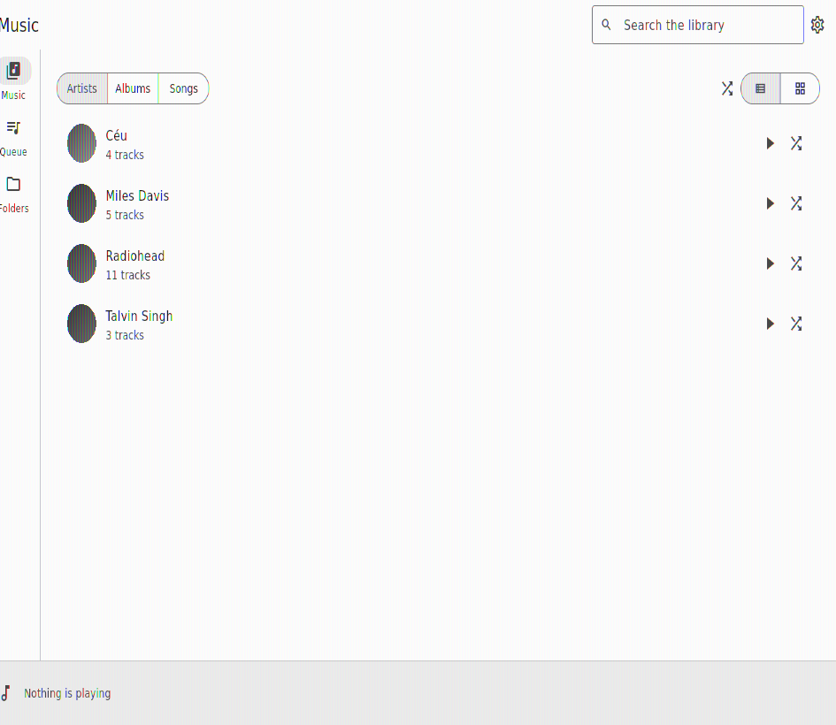
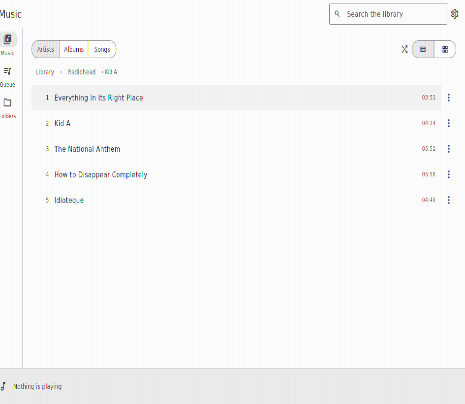

# Orpheus

A music player for Windows, Linux and Android. It reads the audio files already
on the machine it is running on, names every track by its tags rather than by
its file name, and plays them — with the same interface on all three platforms.

It is the music half of [Alexandria](https://github.com/artur-rios/alexandria-ui)
taken out on its own: the same browsing area, the same persistent playback bar,
the same full-window player. What changed is what stands behind it. Alexandria
reads its catalog from a Rust core over FFI; Orpheus has no core and no server.
It walks the folders it is pointed at, reads the tags itself, and keeps the
result in a file beside its own settings.

> **Status:** complete and tested — the unit and widget suite green and
> `flutter analyze` clean. Every use case in the [specifications](#specifications)
> is implemented — see the [roadmap](#roadmap). All three release builds and the
> Windows installer are produced and verified by CI on every pull request. It
> runs on Linux, Windows and Android: the fixes released since 1.0.0 came from
> running it on a Windows machine and an Android phone.

## What it does

- **Reads a library from folders you choose.** Register one or more folders and
  Orpheus walks them, reads the tags out of every audio file, and pulls out the
  cover art. Nothing is indexed that you did not point it at.
- **Browses by artist, album and song**, in rows or as a wall of sleeves, with a
  breadcrumb back out of whatever you drilled into.
- **Plays a track, a record, an artist, or everything shuffled**, with a queue
  you can see and jump around in, repeat, and a resume point per track.
- **Shows what is playing everywhere** — a persistent bar across the bottom, and
  a full player with the record's own sleeve as large as the window allows.
- **Draws the music itself.** The bars on the player are the spectrum of the
  recording, measured from its own samples by the same engine that plays it,
  analysed once per track and kept.
- **Keeps playing on Android once you switch away**, from a notification and the
  lock screen that carry the sleeve and the transport buttons — and stops for a
  phone call, and for headphones pulled out of the socket.
- **Shows the words, in time with the music.** Your own files come first — a
  `.lrc` beside the track, or the track's own lyrics tag. For a track that has
  neither, Orpheus looks the words up online and saves them as a `.lrc` beside
  it, so it only ever asks once; that lookup is a switch in the preferences and
  it sends the track's artist and title — with its record and length where the
  tags give them — and nothing else. The line being sung
  is lit, the sheet scrolls itself, and tapping a line plays from there.
- **Searches** across titles, artists and albums, ranked so a match at the start
  of a title comes above one buried in the middle of something else.
- **Says what you actually listen to** — total plays, and the most played
  tracks, artists, records and genres, counted from your own listening and
  nobody else's.
- **Adapts to the window**: a rail down the side on a desktop, a bar across the
  bottom on a phone, and the same rules at every width in between.
- **Light and dark, English and Brazilian Portuguese.**

## What it doesn't do

- **It never touches your audio files.** No tag editing, no renaming, no
  moving, no deleting, no transcoding. It opens them for reading and that is
  all. The one thing it ever writes into a music folder is a `.lrc` next to a
  track whose words it looked up — a new file, never a replacement for one you
  wrote, and never the track itself.
- **Almost no network.** No streaming, no scrobbling, no telemetry, no
  analytics, no crash reporting, no cover art fetched from anywhere. There are
  two exceptions, and both can be turned off: the lyrics lookup described
  above, and on Windows and Linux the check for a newer release
  ([below](#updating-from-inside-the-application)). The
  Android package declares exactly eight permissions and CI fails the build on
  a ninth, which is the version of this promise a machine can check. The
  broadest of the eight is all-files access, and it is asked for at one moment
  only: a folder you registered has turned out to be on a memory card or a
  drive plugged into the phone, which Android mounts where no narrower
  permission reaches. A library that lives where Android expects it never meets
  it, and granting it changes nothing about the promise above — the folders
  read are still the folders you registered.
- **No accounts, no sync, no cloud.** One person, one machine, one library.
  Nothing Orpheus sends identifies you, or persists between requests: there is
  no account, no key, and no identifier of any kind.

## Specifications

The project is specified before it is built. Start with the `initial/`
documents for context, then the `requirements/` documents for the normative
detail.

| Document | What's in it |
| --- | --- |
| [Brainstorm](docs/initial/Brainstorm.md) | The original free-form notes this project grew from. |
| [Project Overview](docs/initial/Project%20Overview.md) | What it is, who it's for, and how success is measured. |
| [Technology Stack](docs/initial/Technology%20Stack.md) | The informal stack decisions and the reasoning behind them. |
| [Workflow](docs/initial/Workflow.md) | How one use case is delivered, step by step. |
| [Business Rules](docs/initial/Business%20Rules.md) | The domain entities and the `BR-xx` rules. |
| [Vision Document](docs/requirements/Vision%20Document.md) | Stakeholders, positioning, and the `F-xx` features. |
| [System Requirements Document](docs/requirements/System%20Requirements%20Document.md) | The `FR-<AREA>-xx` and `NFR-xx` requirements, the data model, and traceability. |
| [Use Case Specification Document](docs/requirements/Use%20Case%20Specification%20Document.md) | The `UC-xx` use cases, their flows, and their `AF-xx` alternatives. |
| [Development Workflow Document](docs/requirements/Development%20Workflow%20Document.md) | The normative branch pattern, issue lifecycle, and Definition of Done. |
| [Testing Specification Document](docs/requirements/Testing%20Specification%20Document.md) | How tests are written, named, and run. |
| [Technology Stack Document](docs/requirements/Technology%20Stack%20Document.md) | The single source of truth for every technology and version. |
| [Operations & Infrastructure Document](docs/requirements/Operations%20%26%20Infrastructure%20Document.md) | Layout, storage, startup, permissions, logging, and the `IR-xx` requirements. |

## Screenshots

The library, and a record opened inside it:

| Artists | Inside a record |
| --- | --- |
|  |  |

## Installing and running

Every release publishes a Windows installer, a portable Windows archive, a Linux
installer and an Android APK on the
[releases page](https://github.com/artur-rios/orpheus/releases) — see
[Downloads](#downloads) below. Orpheus is a Flutter application, and it can also
be built from source:

```bash
flutter pub get
flutter run -d linux      # or -d windows, or a connected Android device
```

If you are going to change the code rather than just run it, use
[`tools/dev.sh`](CONTRIBUTING.md#running-it-while-you-work-on-it) instead — it picks the
device, checks what the platform needs, and can reset the application to a
first launch.

**Linux** additionally needs libmpv at runtime — the playback engine is
media_kit, which is libmpv-backed:

```bash
sudo apt install libmpv-dev mpv     # Debian and Ubuntu
```

**Android** needs no extra dependency; the engine ships inside the package. The
minimum supported release is Android 7 (API 24) — read back out of the built
package rather than asserted, and set by the plugins rather than by the engine.

**Windows** needs no extra dependency either — the engine's DLLs are bundled by
`media_kit_libs_audio`. For a Windows machine you would rather not build on,
`tools\build-windows-installer.ps1` produces a normal setup executable —
see [The Windows installer](CONTRIBUTING.md#the-windows-installer).

### Downloads

Each release carries four artifacts:

| Platform | File | What it is |
| --- | --- | --- |
| Windows | `orpheus-setup-<version>.exe` | The installer, from Inno Setup |
| Windows | `orpheus-<version>-windows-x64-portable.zip` | Unpack and run; nothing installed |
| Linux | `orpheus-installer-<version>.sh` | The shell installer below |
| Android | `orpheus-<version>-android.apk` | Installed directly, not from a store |

Every file is checksummed into `SHA256SUMS.txt`, which is the only way somebody
can tell that what they downloaded is what the workflow built — both desktop
installers are unsigned.

The Windows portable artifact is an archive rather than a single `.exe`, and
that is not a shortcut: a Flutter Windows application is an executable beside
the engine's DLLs and a `data` directory, and it does not run without them.

The Windows installer offers a per-machine or per-user install, an optional desktop
icon, and both languages the application ships. Upgrading over an existing
installation removes the old one first — including one left in a different
directory, if you moved it — and the removal is targeted at the files this
payload writes rather than being a wipe of a directory you chose by hand.

**Your library, catalog, statistics and settings are never touched by
installing, upgrading or uninstalling.** They live in the application-support
directory; an uninstall is not a request to forget what you listened to.

The Windows installer is **unsigned**. SmartScreen will warn on first run until the
project holds a code-signing certificate, which it does not.

What the Linux installer does:

```sh
./orpheus-installer-1.0.0.sh              # just for you, under ~/.local
./orpheus-installer-1.0.0.sh --system     # for everyone, under /usr/local
./orpheus-installer-1.0.0.sh --prefix DIR # somewhere you choose
./orpheus-installer-1.0.0.sh --uninstall  # remove it again
```

It unpacks the bundle, links the binary onto `PATH`, writes a desktop entry and
an icon so it appears in the applications menu, and keeps a copy of itself
beside the payload so uninstalling later needs nothing downloaded. The per-user
install needs no root and is the default. Uninstalling removes only what it put
down, and never the owner's catalog, statistics or settings.

### First run

The library starts empty and stays empty until you point it somewhere. Open
**Folders**, add the folder your music is in — or press **Add my music folder**,
which offers the platform's conventional one — and the scan starts. On Android
the system asks for permission to read audio files at that point; it is asked
for once you have registered a folder, never before. Android also asks to be
allowed to post the playback notification, and that one is asked for the first
time you press play. Refusing it costs the notification and nothing else —
playback still runs, and still runs in the background.

A folder on a memory card or on a drive plugged into the phone is the one case
that permission does not cover: Android mounts those on volumes outside it, so
the scan walks the folder, finds nothing, and reports it as one that was not
there. The Folders screen then says so and offers the way through, which is
all-files access — a system settings screen you are taken to, and can take the
permission back on at any time.

Granting it may not be the end of it, and the Folders screen says that too.
Android settles which storage an application may reach at the moment that
application starts, so a card slotted in — or a drive plugged in, or this
permission granted — after Orpheus was already running is outside the view
that run was handed, and the folder goes on reading as one that is not there.
With the card or the drive in place, close Orpheus, open it again, and scan.

### Updating from inside the application

The two desktop builds check for a newer release when they start, and offer it.
A full release is only ever offered full releases; a beta is offered the next
beta and then the release it leads to. Switched on by default, and switched off in the preferences under *Updates* —
it is one of the two things in this application that reach a network, and it is
described where it is turned on rather than in a changelog.

What it does when the owner accepts is fetch the same installer they would have
downloaded by hand, check its SHA-256 against the `SHA256SUMS.txt` the release
publishes beside it, and start it. **Nothing is run that has not been
verified**, and a package whose checksum does not match is not offered a retry:
what failed there is not the network.

The application cannot replace itself while it is running — on Windows the
executable and the engine's libraries are open and locked by the process doing
the replacing — so it quits and lets the installer work. That also means the
upgrade is the one that has been tested: the same removal of the previous
version, the same targeted sweep of stale libraries, the same untouched
catalog and statistics.

One case it cannot finish: a Linux installation under a system prefix needs
root, and there is no password prompt to raise from a process the desktop
launched. It downloads and verifies, then hands back the `sudo` line to paste.

Android is not part of this. A package there is installed by the platform, and
the switch is hidden on it.

## How it works

Eight things happen, and they are worth reading in this order.

**A scan walks the folders and reads the tags.** It runs on an isolate of its
own, because it is the whole of the expensive half of this application: a walk
of every path under the library folders and a parse of every audio file among
them. Progress is reported from a strip above the playback bar, and the library
already on screen stays usable while it runs.
(`features/library/data/scan_worker.dart`)

**Tags are read in pure Dart** — `audio_metadata_reader`, covering ID3, Vorbis
comments, iTunes atoms, RIFF and APE. Pure Dart matters here: it is the one
component that would otherwise need a native build per target, and a reader that
cannot run in a test is a reader whose parsing nobody checks.
(`features/library/data/tag_reading.dart`)

**Cover art is extracted once, at scan time, and stored by content.** The id of
a picture is a hash of its bytes, so the twelve tracks of a record that each
carry the same JPEG store it once — which keeps the cache proportional to the
number of records rather than the number of files. A record with no embedded art
but a `cover.jpg` beside it uses that instead.
(`features/library/domain/cover_store.dart`)

**Whose record a track is on is worked out across the record, not per file.**
Several common tag formats have no album-artist field at all, and half-tagged
libraries are the norm — so a rap record whose tracks credit a different guest
each time is one artist rather than twelve. One track carrying the tag settles
the record; with no tag anywhere, the performer most of the record's tracks name
is taken as its artist. That last rule is a judgement, and it is documented as
one where it lives. A record is its title *and* its folder for this purpose:
two artists who both called something *Greatest Hits* are two records, and
pooling them by title alone put one artist's tracks under the other's name and
took the second artist out of the library entirely.
(`features/library/domain/music_grouping.dart`)

**The catalog is a single JSON document, written atomically.** It is read back at
launch so a start is fast, and re-scanned behind the interface: a file still on
disk at the same size and timestamp is carried over rather than re-parsed, which
is what makes re-scanning an unchanged library cheap enough to do at every
launch. Encoding and decoding it happen on an isolate, not on the interface's:
on a large library the document is megabytes, and parsing it is the one piece of
startup work that would otherwise land on the thread drawing the first screen.
It is rewritten only when the scan actually added or removed something — a scan
that changed nothing would encode the file that is already on disk. The *moment*
of the scan is kept beside it in the settings rather than only inside it, because
that does change every time and it is one short string: left in the document
alone it never advanced for an unchanged library, so the library screen kept
showing an older date and the cheap walk below never moved its cutoff forward.
(`features/library/data/json_catalog_store.dart`)

**The scan at startup trusts folder timestamps; the one you ask for does not.**
A folder whose own timestamp predates the last scan has had nothing added to it,
removed from it or renamed inside it, so its tracks are taken from the catalog
instead of being `stat`ed one by one — on a library of eleven thousand tracks
that is eleven thousand system calls a launch does not make. What it cannot see
is a file rewritten in place, which changes the file's timestamp and not its
folder's, so **Scan now** on the library screen still stats everything.
(`features/library/data/scan_worker.dart`)

**The player outlives the screen that started it.** The queue and the engine
live in a controller; the bar and the full player are views of it. A file that
is missing or will not decode is named, stepped over, and the queue carries on;
when the queue runs out of tracks to try, it says so.
(`features/playback/application/audio_playback_controller.dart`)

**On Android the notification is the background playback.** A foreground
service is the only way the system lets a process keep making noise once it is
no longer on screen, and the notification is what a foreground service is
obliged to post — so the two are one thing rather than a feature and its
decoration. The session behind it is a third view of the same player, alongside
the bar and the full player: it shows what is playing and it sends back what was
pressed, and it holds no queue of its own. What comes back through it is not
only the transport buttons — a phone call arriving and a pair of headphones
leaving the socket arrive as the same ask, which is why the player never learns
the difference between them. On Windows and Linux the same seam is bound to a
session that shows nothing, which is why none of the code above it has a
platform check in it.
(`features/playback/domain/media_session.dart`)

**A play is counted at half the track, or four minutes.** The convention
scrobblers have used for twenty years, and it is the right shape in both
directions: a two-minute song abandoned after forty seconds was not listened
to, and an hour-long live set does not stop counting because you left before
the encore. The counter resets when a track *opens* rather than when the track
changes, which is what makes a song left on repeat worth a play each time
round. The rankings themselves are never stored — they are worked out by
reading the play history against the catalog, so re-tagging a library corrects
its history instead of leaving the old names ranked forever.
(`features/stats/domain/play_threshold.dart`)

### The sound bars

The moving bars on the player screen are the **real spectrum of the recording**,
measured from its own samples. The engine reports a position and nothing about
the waveform behind it, so the track is analysed separately: the same libmpv
that plays it is told to decode it to mono at 16 kHz and write it to a scratch
file as fast as it can, and a windowed Fourier transform over that gives sixteen
logarithmically spaced bands, about thirty rows a second, levelled against the
track's own loudest moment so a quietly mastered record still moves. A
four-minute track takes about a second to analyse and a hundred kilobytes to
keep, and it is kept — cached beside the covers under a key that carries the
file's length and modification time, so a track is analysed once and a re-rip of
it is analysed again.

Using the playback engine as the decoder is what makes this work everywhere:
whatever Orpheus can play, it can analyse, on all three platforms, with no
second codec library and no format that plays but does not draw.

The analysis runs off the interface's isolate and does not hold up playback, so
there is a second on first play before it lands. Until it does — and for a file
that could not be decoded at all — the bars fall back to a **stand-in**
synthesised from the track's identity: deterministic (the same second of the
same track draws the same bars every time) and distinct (two tracks move
differently). It is a sign that something is playing rather than an analysis,
and the code says so where it is defined.
(`features/playback/domain/track_energy.dart`,
`features/playback/domain/audio_spectrum.dart`,
`features/playback/data/mpv_track_analysis.dart`)

### The words

Synced lyrics come from the machine the music is on first. Three places are
looked in, in this order: an
`.lrc` file beside the track and named after it; the track's `SYLT` frame; and
the track's lyrics text tag — `USLT` in an MP3, `©lyr` in an MP4, `LYRICS` in a
Vorbis comment or an APE tag. The sidecar wins over both, because it is the one
of the three an owner can write, correct or delete with a text editor and no
help from this application.

`SYLT` comes next because it is the frame that actually carries times: a moment
and a piece of text, held as structure rather than as text somebody hoped a
player would parse. The tag-reading package used everywhere else here surfaces
`USLT` — the frame that by definition has no times in it — and stops, so the ID3
tag is walked directly for `SYLT` before the text frame is consulted. It is a
header read: the tag's own first ten bytes say how long it is, exactly that much
is read, and the audio behind it is never touched. ID3v2.2 through v2.4, the
four text encodings, unsynchronisation whole or per frame, an extended header
and a data-length indicator are all covered, because real files carry all of
them. A frame that is compressed, encrypted, carrying something other than words
— the format allows chords and trivia in the same frame — or timed in MPEG
frames rather than milliseconds is declined, and the text frame answers instead.

The sidecar and the text frames are read with one LRC reader, since a lyrics tag
very often holds LRC pasted into it. It takes the parts of that format real
files actually use: the `[ti:]`-style header, several times on one line for a
refrain, `[offset:]`, and the per-word times of enhanced LRC, which are dropped
because this lights a line at a time. A file with no times in it at all is read
as a plain sheet and said to be one, rather than rejected or given invented
times — nothing here guesses when a line is sung.

Only when none of the three has anything, and only while the lookup is left on
in the preferences, is a lyrics service — [LRCLIB](https://lrclib.net) — asked,
with the track's artist and title and, where the tags give them, its record and
length. A sheet that comes back is written beside the track as a new `.lrc`, so
the next play finds it in the first place looked and asks nobody anything; a
`.lrc` already there is never replaced. A track whose tags do not give both an
artist and a title is not looked up at all.
(`features/lyrics/application/lyrics_controller.dart`,
`features/lyrics/data/lrclib_lyrics_source.dart`,
`features/lyrics/data/file_lyrics_sidecar.dart`)

On the player the words take the sleeve's place rather than sitting under it —
both want the same room — the line being sung is lit and brought into view by
itself, tapping a line plays from there, and the panel leaves you where you
scrolled to for a few seconds so that reading ahead is possible.
(`features/lyrics/data/lrc_parsing.dart`,
`features/lyrics/data/id3_synced_lyrics.dart`,
`features/lyrics/data/file_lyrics_source.dart`,
`features/lyrics/domain/lyrics.dart`)

## Known limits

- **No media session on Windows or Linux.** Neither desktop gets transport keys
  or a system now-playing panel. The seam that would carry them exists and is
  bound to a session that shows nothing, so this is an implementation to write
  rather than a design to change.
- **Lyrics are found, never edited.** A track whose words are on neither side
  of it — no `.lrc`, no `SYLT`, no lyrics text tag — and that the lookup finds
  nothing for, or that is not looked up because the lookup is off or the tags
  lack an artist or a title, shows a panel that says so. Nothing is corrected
  or re-timed, the only thing ever saved is the new `.lrc` a lookup writes, and
  a `SYLT` frame whose times are counted in MPEG frames rather than milliseconds
  is declined rather than approximated: turning those into a position needs the
  frame rate of the audio behind them, and this reads headers, not streams.
- **No playlists.** Queues are built from a track, a record, an artist, or the
  whole library shuffled. There is nothing to save and name yet.
- **The statistics are all-time, with no windows.** "This month" is a control, a
  parameter, and a second set of numbers to explain, and none of it is worth
  adding before anyone has read the first set. The history stores a count per
  file rather than a row per play, which is what keeps it proportional to the
  number of tracks ever played — and which is what a time window would have to
  undo.
- **The rankings are only as good as the tags.** A library where the same artist
  is spelled two ways ranks as two artists, and nothing here can tell that from
  two artists who really exist.
- **A track is identified by its path.** Move a file and it is a different track
  to this application, and its resume point does not follow it. Re-scanning is
  what reconciles that.
- **Album artist for MP4, Vorbis and RIFF tags is derived rather than read.**
  Those formats' readers here do not surface a distinct album-artist field, so
  the across-the-record derivation described above is what answers for them. For
  an ordinary record it gives the same answer; a various-artists compilation with
  no album-artist tag anywhere lands under whichever performer has the most
  tracks on it.
- **The Windows installer is built but never installed.** CI compiles
  `packaging/windows/installer.iss` on a Windows runner for every pull request, so the
  setup executable is known to build and to carry the whole payload. What nobody
  has done is *run* it — install, upgrade over an older install, and uninstall
  are specified and reviewed but unexercised. The upgrade path in its `[Code]`
  section is the part most worth someone's attention.

## Roadmap

Nine milestones covering thirty-three issues: one foundation issue plus one
issue per use case. Milestones are dependency-ordered — no milestone depends on a later
one, and every milestone after `M-01` depends on it.

The live view is the [project board](https://github.com/users/artur-rios/projects/13)
and GitHub's own milestone pages; the counts here are as of the last update to
this file.

| Milestone | Delivers | Depends on | Issues | Status |
| --- | --- | --- | --- | --- |
| [M-01 — Foundation](https://github.com/artur-rios/orpheus/milestone/1) | The project scaffold, the layering, the composition root, and the cross-cutting infrastructure every use case is built on (IR-01 … IR-28) | — | 1 | 1 / 1 closed |
| [M-02 — Shell and preferences](https://github.com/artur-rios/orpheus/milestone/2) | A window the owner can open, navigate, theme and translate, with preferences that apply immediately and persist | M-01 | 2 | 2 / 2 closed |
| [M-03 — Library sources and scanning](https://github.com/artur-rios/orpheus/milestone/3) | Folders can be registered, permitted, scanned, reviewed and unregistered — the catalog gets its content | M-02 | 6 | 6 / 6 closed |
| [M-04 — Browsing and search](https://github.com/artur-rios/orpheus/milestone/4) | The library can be browsed by artist, record and song, laid out two ways, and searched | M-03 | 6 | 6 / 6 closed |
| [M-05 — Playback](https://github.com/artur-rios/orpheus/milestone/5) | A track, a record, an artist or the whole library can be played, with a queue, repeat, resume, and a player that survives a bad file | M-04 | 11 | 11 / 11 closed |
| [M-06 — Background playback](https://github.com/artur-rios/orpheus/milestone/6) | Playback continues on Android once the application is off screen, controllable from the notification, the lock screen and a headset | M-05 | 2 | 2 / 2 closed |
| [M-07 — Listening statistics](https://github.com/artur-rios/orpheus/milestone/7) | Plays are counted from the owner's own listening and presented as totals and four rankings | M-05 | 2 | 2 / 2 closed |
| [M-08 — Lyrics](https://github.com/artur-rios/orpheus/milestone/8) | The words of what is playing — the owner's own files first, a lookup for the tracks they have none for — following the music where the sheet carries times | M-05 | 3 | 3 / 3 closed |
| [M-09 — Sound bars](https://github.com/artur-rios/orpheus/milestone/9) | The spectrum of the recording being played, measured from its own samples, cached per track, with a stand-in until it lands | M-05 | 1 | 1 / 1 closed |

## Backlog

### M-01 — Foundation

| Issue | Work | Spec |
| --- | --- | --- |
| [#1](https://github.com/artur-rios/orpheus/issues/1) | Project scaffold and cross-cutting infrastructure (IR-01 … IR-28) — done | [Operations & Infrastructure](docs/requirements/Operations%20%26%20Infrastructure%20Document.md) |

### M-02 — Shell and preferences

| Issue | Work | Spec |
| --- | --- | --- |
| [#2](https://github.com/artur-rios/orpheus/issues/2) | UC-28 — Navigate the application shell — done | [Use Case Specification](docs/requirements/Use%20Case%20Specification%20Document.md) |
| [#3](https://github.com/artur-rios/orpheus/issues/3) | UC-29 — Manage preferences — done | [Use Case Specification](docs/requirements/Use%20Case%20Specification%20Document.md) |

### M-03 — Library sources and scanning

| Issue | Work | Spec |
| --- | --- | --- |
| [#4](https://github.com/artur-rios/orpheus/issues/4) | UC-01 — Register a music folder — done | [Use Case Specification](docs/requirements/Use%20Case%20Specification%20Document.md) |
| [#5](https://github.com/artur-rios/orpheus/issues/5) | UC-02 — Add the conventional music folder — done | [Use Case Specification](docs/requirements/Use%20Case%20Specification%20Document.md) |
| [#6](https://github.com/artur-rios/orpheus/issues/6) | UC-03 — Grant read access to audio files — done | [Use Case Specification](docs/requirements/Use%20Case%20Specification%20Document.md) |
| [#7](https://github.com/artur-rios/orpheus/issues/7) | UC-04 — Scan the library folders — done | [Use Case Specification](docs/requirements/Use%20Case%20Specification%20Document.md) |
| [#8](https://github.com/artur-rios/orpheus/issues/8) | UC-05 — Review the files a scan could not read — done | [Use Case Specification](docs/requirements/Use%20Case%20Specification%20Document.md) |
| [#9](https://github.com/artur-rios/orpheus/issues/9) | UC-06 — Unregister a music folder — done | [Use Case Specification](docs/requirements/Use%20Case%20Specification%20Document.md) |

### M-04 — Browsing and search

| Issue | Work | Spec |
| --- | --- | --- |
| [#10](https://github.com/artur-rios/orpheus/issues/10) | UC-07 — Browse the library by artist — done | [Use Case Specification](docs/requirements/Use%20Case%20Specification%20Document.md) |
| [#11](https://github.com/artur-rios/orpheus/issues/11) | UC-08 — Browse an artist's records — done | [Use Case Specification](docs/requirements/Use%20Case%20Specification%20Document.md) |
| [#12](https://github.com/artur-rios/orpheus/issues/12) | UC-09 — Browse a record's tracks — done | [Use Case Specification](docs/requirements/Use%20Case%20Specification%20Document.md) |
| [#13](https://github.com/artur-rios/orpheus/issues/13) | UC-10 — Browse every song — done | [Use Case Specification](docs/requirements/Use%20Case%20Specification%20Document.md) |
| [#14](https://github.com/artur-rios/orpheus/issues/14) | UC-11 — Switch between rows and sleeves — done | [Use Case Specification](docs/requirements/Use%20Case%20Specification%20Document.md) |
| [#15](https://github.com/artur-rios/orpheus/issues/15) | UC-12 — Search the library — done | [Use Case Specification](docs/requirements/Use%20Case%20Specification%20Document.md) |

### M-05 — Playback

| Issue | Work | Spec |
| --- | --- | --- |
| [#16](https://github.com/artur-rios/orpheus/issues/16) | UC-13 — Play a track — done | [Use Case Specification](docs/requirements/Use%20Case%20Specification%20Document.md) |
| [#17](https://github.com/artur-rios/orpheus/issues/17) | UC-14 — Resume a track where it stopped — done | [Use Case Specification](docs/requirements/Use%20Case%20Specification%20Document.md) |
| [#18](https://github.com/artur-rios/orpheus/issues/18) | UC-15 — Play a record — done | [Use Case Specification](docs/requirements/Use%20Case%20Specification%20Document.md) |
| [#19](https://github.com/artur-rios/orpheus/issues/19) | UC-16 — Play everything by an artist — done | [Use Case Specification](docs/requirements/Use%20Case%20Specification%20Document.md) |
| [#20](https://github.com/artur-rios/orpheus/issues/20) | UC-17 — Shuffle the whole library — done | [Use Case Specification](docs/requirements/Use%20Case%20Specification%20Document.md) |
| [#21](https://github.com/artur-rios/orpheus/issues/21) | UC-18 — Pause, seek and set the volume — done | [Use Case Specification](docs/requirements/Use%20Case%20Specification%20Document.md) |
| [#22](https://github.com/artur-rios/orpheus/issues/22) | UC-19 — Move through the queue — done | [Use Case Specification](docs/requirements/Use%20Case%20Specification%20Document.md) |
| [#23](https://github.com/artur-rios/orpheus/issues/23) | UC-20 — Repeat a queue or a track — done | [Use Case Specification](docs/requirements/Use%20Case%20Specification%20Document.md) |
| [#24](https://github.com/artur-rios/orpheus/issues/24) | UC-21 — See what is playing — done | [Use Case Specification](docs/requirements/Use%20Case%20Specification%20Document.md) |
| [#25](https://github.com/artur-rios/orpheus/issues/25) | UC-22 — Open the full player — done | [Use Case Specification](docs/requirements/Use%20Case%20Specification%20Document.md) |
| [#26](https://github.com/artur-rios/orpheus/issues/26) | UC-23 — Step over a file that will not play — done | [Use Case Specification](docs/requirements/Use%20Case%20Specification%20Document.md) |

### M-06 — Background playback

| Issue | Work | Spec |
| --- | --- | --- |
| [#27](https://github.com/artur-rios/orpheus/issues/27) | UC-24 — Keep playing in the background — done | [Use Case Specification](docs/requirements/Use%20Case%20Specification%20Document.md) |
| [#28](https://github.com/artur-rios/orpheus/issues/28) | UC-25 — Control playback from outside the application — done | [Use Case Specification](docs/requirements/Use%20Case%20Specification%20Document.md) |

### M-07 — Listening statistics

| Issue | Work | Spec |
| --- | --- | --- |
| [#29](https://github.com/artur-rios/orpheus/issues/29) | UC-26 — Count a track as played — done | [Use Case Specification](docs/requirements/Use%20Case%20Specification%20Document.md) |
| [#30](https://github.com/artur-rios/orpheus/issues/30) | UC-27 — See what you listen to — done | [Use Case Specification](docs/requirements/Use%20Case%20Specification%20Document.md) |

### M-08 — Lyrics

Built, tested and specified, and merged.

| Issue | Work | Spec |
| --- | --- | --- |
| [#31](https://github.com/artur-rios/orpheus/issues/31) | UC-30 — Read the words of what is playing — done | [Use Case Specification](docs/requirements/Use%20Case%20Specification%20Document.md) |
| [#32](https://github.com/artur-rios/orpheus/issues/32) | UC-31 — Follow the words and jump to a line — done | [Use Case Specification](docs/requirements/Use%20Case%20Specification%20Document.md) |
| [#34](https://github.com/artur-rios/orpheus/issues/34) | UC-33 — Look the words up for a track that has none — done | [Use Case Specification](docs/requirements/Use%20Case%20Specification%20Document.md) |

### M-09 — Sound bars

| Issue | Work | Spec |
| --- | --- | --- |
| [#33](https://github.com/artur-rios/orpheus/issues/33) | UC-32 — See the music move — done | [Use Case Specification](docs/requirements/Use%20Case%20Specification%20Document.md) |

## Changelog

Notable changes in each release are recorded in [CHANGELOG.md](./CHANGELOG.md). Releases follow
[Semantic Versioning](https://semver.org/).

## Contributing

Building from source, running the tests, the development tooling, the branching model and the release process are
described in [CONTRIBUTING.md](./CONTRIBUTING.md).

## Legal

This project is licensed under the terms of the [MIT License](./LICENSE). Copyright (c) 2026 Artur Rios.
