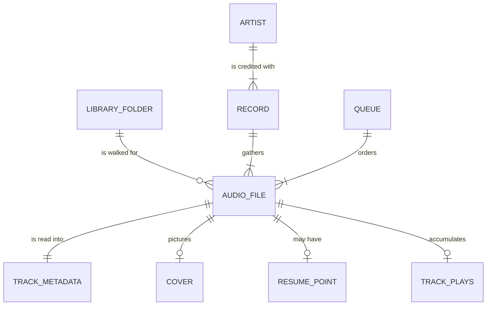

# Business Rules — Orpheus

The domain this application reasons about, and the rules it holds itself to.
Rules are `BR-xx` and are referenced by the requirements and the use cases.

## 1. Entities

| Entity | What it is |
| --- | --- |
| **Library folder** | A directory on disk the owner registered as a source. Several may exist. Stored as a path. |
| **Audio file** | One file with a supported extension found under a library folder. Identified by its absolute path. |
| **Track metadata** | What the file's tags say: title, artist, album artist, album, genre, track and disc numbers, year, duration, and the id of its cover. Every field is optional. |
| **Cover** | A picture extracted at scan time, addressed by a hash of its bytes. |
| **Record** | Not stored. A grouping derived from the files that share an album and an album artist. |
| **Artist** | Not stored. A grouping derived from the album artist. |
| **Queue** | What is playing and in what order. Lives for a session; never persisted. |
| **Resume point** | Where playback stopped in one file. |
| **Track plays** | How many times one file has counted as played, and when it last did. |

## 2. Identity and ownership

**BR-01 — A track is identified by its absolute path.** There is no catalog
server to mint an id and no database to hold one, and a path is what every other
part of the application must have anyway.

> *Consequence, stated rather than hidden:* moving a file makes it a different
> track to this application. Its resume point and its play count do not follow
> it. Re-scanning is what reconciles that.

**BR-02 — The owner's files are read and never written.** No tag is edited, no
file is renamed, moved, deleted or transcoded. Everything this application
writes lives in its own directory.

**BR-03 — Nothing leaves the machine.** No lookup, no upload, no fetch, no
telemetry. The absence of an `INTERNET` permission in the Android package is
the enforceable form of this rule.

**BR-04 — Nothing is indexed that was not pointed at.** Only registered folders
are walked.

## 3. Naming and tags

**BR-05 — A track is named by its tags, never by its file name.** This is the
point of the browsing area. A file whose tags carry no title has no name in
this application's terms.

**BR-06 — An absent tag is absent, not a word.** The domain carries `null`.
What to *show* for an absent tag is a presentation decision, made in one place,
and never by defaulting to the file name in a data layer.

> **The two exceptions, and why they are exceptions.** The folders screen names
> the files a scan could not read, and the track ranking on the statistics
> screen names a track whose tags carry no title. Both do it by file name.
> In each case the alternative is a list of identical rows — "Untitled" ten
> times — which is a list nobody can act on. Both are deliberate and are
> documented where they live.

**BR-07 — A blank tag is an absent tag.** A tag of whitespace names nothing.
One trimming rule, applied everywhere.

## 4. How a record's artist is decided

**BR-08 — Whose record a track is on is worked out across the record, not per
file.** Several common tag formats carry no album-artist field at all, and
half-tagged libraries are the norm.

The answer is taken in this order:

1. the file's own album-artist tag — the record answering for itself;
2. what the rest of the record says, where one track carries the tag and others
   do not;
3. the track's own performer, for a file belonging to no record the library can
   see.

> *Rule 2 is what keeps a rap record out of the artists list twelve times over.*
> A record whose tracks are tagged `50 Cent`, `50 Cent feat. Nate Dogg` and
> `Eminem, 50 Cent`, carrying no album artist anywhere, is one record by one
> artist. Falling straight through to the performer would list every guest as an
> artist in their own right.

**BR-09 — Where no track on a record carries an album-artist tag, the performer
named by most of its tracks is taken as its artist.** This is a judgement, not a
deduction, and it is documented as one where it lives. A various-artists
compilation with no album-artist tag anywhere lands under whichever performer
has the most tracks on it.

## 5. Scanning

**BR-10 — A scan is incremental.** A file still on disk at the same size and
modification time is carried over from the previous catalog rather than
re-parsed. This is what makes re-scanning an unchanged library cheap enough to
do at every launch.

**BR-11 — A file that cannot be read does not stop a scan.** It is recorded,
named to the owner, and the scan carries on.

**BR-12 — Cover art is extracted once and stored by content.** Twelve tracks
carrying the same JPEG store it once, which keeps the cache proportional to the
number of records rather than the number of files. A record with no embedded art
but a `cover.jpg` beside it uses that.

## 6. Playback

**BR-13 — The player outlives the screen that started it.** The queue and the
engine live in a controller; every view of them is a view.

**BR-14 — A file that will not play is named, stepped over, and the queue
carries on.** A missing file and an undecodable one are the same movement. When
the queue runs out of tracks to try, the application says so.

**BR-15 — A resume point is offered for a single track and never for a
sequence.** The question is about one file; a record is a sequence, and being
asked where to start it is not a question the owner asked.

**BR-16 — A track played to its end leaves no resume point.**

**BR-17 — Pressing "previous" restarts the current track when playback is more
than five seconds in, and steps back otherwise.** The behaviour every physical
player has had.

**BR-18 — Shuffle produces an order nobody chose, over a copy.** The library's
own order is never reordered in place.

## 7. Listening statistics

**BR-19 — A track counts as played once the owner has heard half of it, or four
minutes of it, whichever comes first.** The convention scrobblers have used for
twenty years. A short song abandoned early was not listened to; a long recording
does not stop counting because the owner left before the end.

**BR-20 — A length the engine has not reported counts nothing.** With nothing to
take half of, the rule reduces to a guess.

**BR-21 — A play is counted once per playthrough, and again for the next one.**
The counter resets when a track *opens*, not when the current track changes — so
a song left on repeat earns a play each time round.

**BR-22 — Recording a play never interrupts anything.** A statistic that cannot
be written is logged and dropped. Stopping the music to report a missing counter
is the worse failure.

**BR-23 — Rankings are derived, never stored.** They are computed by reading the
play history against the catalog, so re-tagging a library corrects its history
rather than leaving old names ranked forever.

**BR-24 — An absent tag ranks nowhere rather than under an invented word.** A
track with no artist tag is not an artist called "Unknown" at the top of the
owner's chart. It is counted in the totals, excluded from that ranking, and the
screen says why.

## 8. Preferences and presentation

**BR-25 — A preference applies immediately and is written behind.** A
preference that applied but could not be persisted is reported, not swallowed.

**BR-26 — Every colour comes from the theme's single seed.** No colour literal
exists outside the theme.

**BR-27 — Both language catalogs stay complete.** A missing translation is a
build failure, not a string that renders as its key.

**BR-28 — The arrangement follows the window, not the platform.** A rail where
there is width for one, a bar across the bottom where there is not — decided by
width at every size, not by which operating system is running.
