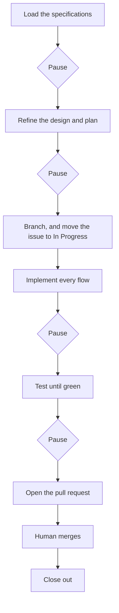

# Workflow — Orpheus

How one use case gets from the backlog to a merged pull request.

This is the informal statement of it. The normative version — branch patterns,
issue lifecycle, Definition of Done — is the
[Development Workflow Document](../requirements/Development%20Workflow%20Document.md).

## Invocation

> Implement UC-14.

That is the whole invocation. Everything below follows from it, and nothing
below starts until the specifications have been read.

## The golden rule: pause at every stage boundary

The work moves through stages. At the boundary between two of them it **stops
and waits for a human**, and it does not carry on because the next step seems
obvious.

The boundaries are:

1. after the specifications are loaded and understood — before designing;
2. after the design and plan are written — before writing any code;
3. after the implementation is written — before testing;
4. after the tests are green — before opening the pull request.

A stage boundary crossed without a human is the failure mode this rule exists
to prevent. The cost of pausing is a message. The cost of not pausing is a
branch full of work built on a misreading.

## Workflow overview



## Step 1 — Load the specifications

Read, in this order:

- the use case itself, in the
  [Use Case Specification Document](../requirements/Use%20Case%20Specification%20Document.md)
  — its main flow, **every** alternative flow, and its notes;
- the requirements it names (`FR-<AREA>-xx`), in the
  [System Requirements Document](../requirements/System%20Requirements%20Document.md);
- the business rules those touch (`BR-xx`), in
  [Business Rules](Business%20Rules.md);
- the [Testing Specification](../requirements/Testing%20Specification%20Document.md),
  because how it will be tested shapes how it is built.

Then say what was understood, in a paragraph, and **pause**.

## Step 2 — Refine the design and plan

Write down: which files will be added or changed, which layer each belongs in,
what goes behind an interface and why, and which behaviours will be tested.

Design decisions that are judgements rather than deductions get written into
the code where they live, not only here. A rule nobody can find is a rule that
gets broken by the next change.

**Pause.**

## Step 3 — Branch and move the issue to In Progress

```
feat/uc-14-resume-a-track
```

`<type>/uc-<number>-<short-name>`. Move the issue to **In Progress** on the
project board.

## Step 4 — Implement

Every flow in the use case, including every alternative. An alternative flow
left unimplemented is a use case that is not done, whatever the main flow does.

Match the surrounding code — its naming, its comment density, its idiom. This
codebase comments the *why*, not the *what*, and a change that comments neither
reads as a change nobody thought about.

**Pause.**

## Step 5 — Test until green

`flutter analyze` must be clean; there is no known-warnings list. `flutter test`
must be green. Tests are Given-When-Then, one behaviour apiece, and follow the
source tree.

Nothing in the suite may read the developer's own preferences, write into their
application-support folder, record against their listening statistics, open the
native playback engine, start a platform media service, or reach the network.
Every one of those is a provider, and every one is overridden by the harness.

**Pause.**

## Step 6 — Open the pull request

Title it after the use case. The body says what was built, which flows are
covered, and what was deliberately left out. Link the issue.

## Step 7 — Close out

After a human merges: the issue closes, the board moves it to **Done**, and the
README backlog row is marked done.

## Definition of Done

- [ ] Every flow in the use case is implemented, alternatives included.
- [ ] `flutter analyze` is clean.
- [ ] `flutter test` is green, and the new behaviour is covered.
- [ ] No test reaches outside the process.
- [ ] Both language catalogs are complete; every message has a description.
- [ ] No colour literal outside `lib/core/theme/`.
- [ ] Judgement calls are documented where they live.
- [ ] The README backlog row is marked done.
