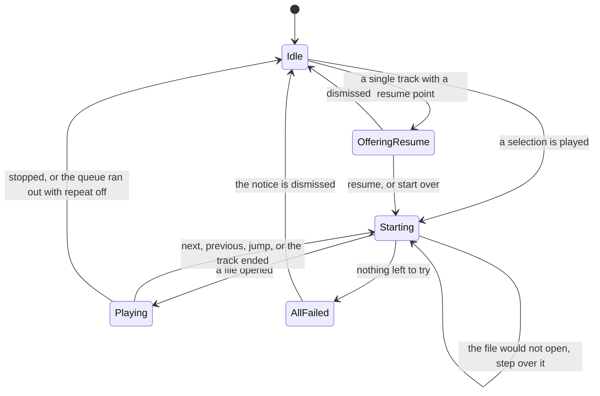
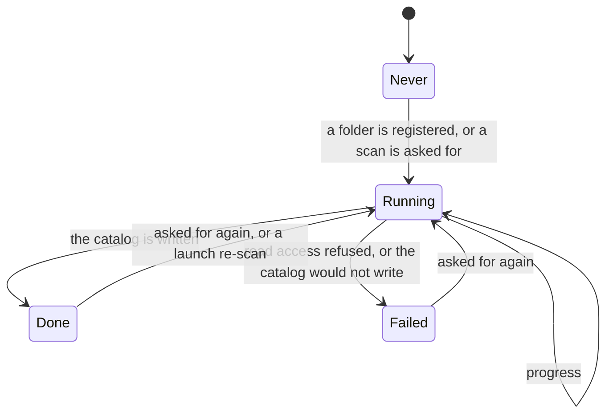
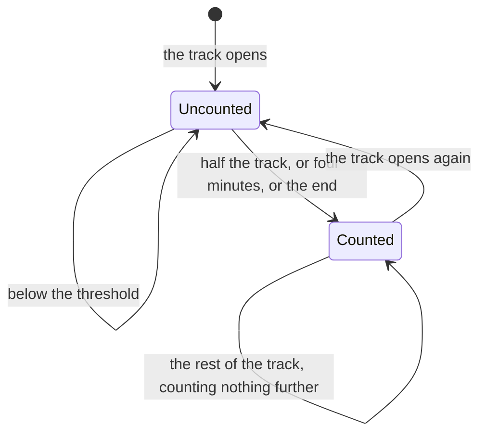

# Use Case Specification Document — Orpheus

## 1. Introduction

### 1.1 Purpose

The use cases that realise the requirements in the
[System Requirements Document](System%20Requirements%20Document.md). Each one
states its actors, its preconditions and postconditions, the requirements it
realises, its main flow, and **every** alternative flow.

An alternative flow is not an edge case to be handled if time allows. It is part
of the use case, and a use case whose alternatives are unimplemented is not
done.

### 1.2 Actors

| Actor | Description |
| --- | --- |
| **Owner** | The single human user, and the only actor with intent. Interacts with every use case below. |
| **Local filesystem** | The disks holding the library folders. Read for audio files and their tags; written only within this application's own directory. |
| **Playback engine** | The libmpv-backed engine linked in process. Opens files, reports position and duration, and reports what it cannot decode. Never modifies a file. |
| **Host platform** | Windows, Linux or Android. Grants or refuses read access, provides the folder picker, and — on Android alone — provides the media session and the foreground service. |

### 1.3 Use case overview

```mermaid
graph LR
    subgraph Actors
        OWNER(("Owner"))
    end

    subgraph "Library sources (LB)"
        UC01[UC-01: Register a folder]
        UC02[UC-02: Add the music folder]
        UC03[UC-03: Grant read access]
        UC04[UC-04: Scan the library]
        UC05[UC-05: Review unreadable files]
        UC06[UC-06: Unregister a folder]
    end

    subgraph "Catalog (CT)"
        UC07[UC-07: Browse by artist]
        UC08[UC-08: Browse an artist's records]
        UC09[UC-09: Browse a record]
        UC10[UC-10: Browse every song]
        UC11[UC-11: Switch the layout]
        UC12[UC-12: Search the library]
    end

    subgraph "Playback (PL)"
        UC13[UC-13: Play a track]
        UC14[UC-14: Resume a track]
        UC15[UC-15: Play a record]
        UC16[UC-16: Play an artist]
        UC17[UC-17: Shuffle everything]
        UC18[UC-18: Pause, seek, volume]
        UC19[UC-19: Move through the queue]
        UC20[UC-20: Repeat]
        UC21[UC-21: See what is playing]
        UC22[UC-22: Open the full player]
        UC23[UC-23: Step over a bad file]
    end

    subgraph "Background (BG)"
        UC24[UC-24: Play in the background]
        UC25[UC-25: Control from outside]
    end

    subgraph "Statistics (ST)"
        UC26[UC-26: Count a play]
        UC27[UC-27: See what you listen to]
    end

    subgraph "Shell (UX)"
        UC28[UC-28: Navigate the shell]
        UC29[UC-29: Manage preferences]
    end

    OWNER --> UC01
    OWNER --> UC07
    OWNER --> UC13
    OWNER --> UC24
    OWNER --> UC27
    OWNER --> UC28
```

---

## 2. Use case specifications

---

### UC-01: Register a music folder

| Field | Value |
| --- | --- |
| **ID** | UC-01 |
| **Name** | Register a music folder |
| **Actors** | Owner, Host platform, Local filesystem |
| **Description** | The owner adds a folder on disk as a source of audio files. Several may be registered. |
| **Preconditions** | None. This is reachable on a first launch. |
| **Postconditions** | The folder is recorded, persists between runs, and is offered for scanning. |
| **Requirements** | FR-LB-01, FR-LB-03, FR-LB-05, FR-LB-06 |

**Main Flow**

1. The application presents the folders screen. With nothing registered, it
   states that the library is empty and what to do about it.
2. The owner opens the platform's native folder picker and chooses a folder.
3. The application checks that the folder exists, can be read, and is not
   already registered.
4. The application records the folder and lists it among the registered ones.
5. A scan is started (UC-04).

**Alternative Flows**

| ID | Condition | Outcome |
| --- | --- | --- |
| AF-01 | The owner dismisses the picker | Nothing is registered and the screen is unchanged. |
| AF-02 | The folder does not exist or cannot be read | The application states which condition failed and registers nothing. |
| AF-03 | The folder is already registered | The application says so and registers nothing a second time. |
| AF-04 | The platform gates reading audio files and has not been asked | Read access is requested first (UC-03); the folder is registered regardless of the answer, because a folder registered without permission is a folder that will scan the moment permission is given. |

---

### UC-02: Add the conventional music folder

| Field | Value |
| --- | --- |
| **ID** | UC-02 |
| **Name** | Add the conventional music folder |
| **Actors** | Owner, Host platform |
| **Description** | The owner registers the folder the platform conventionally keeps music in, without navigating a picker to find it. |
| **Preconditions** | None. |
| **Postconditions** | As UC-01. |
| **Requirements** | FR-LB-02, FR-LB-03, FR-LB-05 |

**Main Flow**

1. The folders screen offers the platform's conventional music folder by name.
2. The owner presses it.
3. The application registers it exactly as UC-01 step 3 onward.

**Alternative Flows**

| ID | Condition | Outcome |
| --- | --- | --- |
| AF-01 | The platform names no such folder, or it does not exist | The offer is not shown. An offer that fails when pressed is worse than no offer. |
| AF-02 | It is already registered | The offer is not shown. |

> **It is offered, never assumed.** A first launch that had silently indexed the
> owner's music folder would have read files it was not pointed at, which is
> `BR-04` broken on the first run.

---

### UC-03: Grant read access to audio files

| Field | Value |
| --- | --- |
| **ID** | UC-03 |
| **Name** | Grant read access to audio files |
| **Actors** | Owner, Host platform |
| **Description** | On a platform that gates reading the owner's audio files, the application asks for that permission. |
| **Preconditions** | A folder has been registered, or is being registered. |
| **Postconditions** | The application either may read audio files, or knows it may not and why. |
| **Requirements** | FR-LB-07, FR-LB-08 |

**Main Flow**

1. The application requests the platform's audio-read permission.
2. The owner grants it.
3. Scanning proceeds.

**Alternative Flows**

| ID | Condition | Outcome |
| --- | --- | --- |
| AF-01 | The platform gates nothing — both desktops | The permission is granted immediately with no dialog, and the flow is indistinguishable from the main one. |
| AF-02 | The owner refuses | The application says the library cannot be read without it, and offers to ask again. Nothing is scanned. |
| AF-03 | The owner refuses in a way the system will not put again | The application says so and offers the system settings screen, which is the only way forward. |
| AF-04 | The platform release predates the per-media permission | The broader legacy permission is requested behind it, so that an older device is asked exactly once for the one permission it has. |

> **Asked once a folder is registered, never before.** A permission dialog on a
> launch where the owner has asked for nothing is a question about nothing.

---

### UC-04: Scan the library folders

| Field | Value |
| --- | --- |
| **ID** | UC-04 |
| **Name** | Scan the library folders |
| **Actors** | Owner, Local filesystem |
| **Description** | The registered folders are walked, every audio file's tags are read, cover art is extracted, and the catalog is rebuilt. |
| **Preconditions** | At least one folder is registered and readable. |
| **Postconditions** | The catalog reflects what is on disk, and is written. |
| **Requirements** | FR-LB-09 … FR-LB-18, FR-CT-02 |

**Main Flow**

1. The scan starts — on demand, after a folder is registered, or at launch when
   the preference says so.
2. It runs away from the interface. The library already on screen stays usable.
3. Every path under every registered folder is walked, and every file with a
   supported extension is considered.
4. A file unchanged since the last scan — same size, same modification time — is
   carried over rather than re-parsed.
5. Every other file's tags are read, and its embedded cover extracted and stored
   by content hash; a record with no embedded art but a cover image beside it
   uses that.
6. Progress is reported throughout, from a strip above the playback bar.
7. The album artist of every record is worked out across that record (`BR-08`).
8. The catalog is written atomically, and the library on screen is replaced by it.

**Alternative Flows**

| ID | Condition | Outcome |
| --- | --- | --- |
| AF-01 | A file's tags cannot be read | It is recorded as unreadable, named to the owner (UC-05), and the scan carries on. |
| AF-02 | A folder has disappeared since it was registered | It contributes nothing and the scan carries on; the folder stays registered, because a folder on a disconnected drive is not a folder the owner wanted removed. |
| AF-03 | Read access is refused | Nothing is scanned and the permission state is reported (UC-03). |
| AF-04 | No folder is registered | Nothing runs. |
| AF-05 | A scan is already running | The request is ignored rather than starting a second walk over the same disks. |
| AF-06 | The catalog cannot be written | The library is usable for this session and the failure is reported; the next scan tries again. |

---

### UC-05: Review the files a scan could not read

| Field | Value |
| --- | --- |
| **ID** | UC-05 |
| **Name** | Review the files a scan could not read |
| **Actors** | Owner |
| **Description** | The owner sees which files the last scan could not read. |
| **Preconditions** | A scan has run and found at least one unreadable file. |
| **Postconditions** | None. This use case only informs. |
| **Requirements** | FR-LB-13 |

**Main Flow**

1. The folders screen states how many files could not be read.
2. The owner opens the disclosure and sees them named.

**Alternative Flows**

| ID | Condition | Outcome |
| --- | --- | --- |
| AF-01 | Every file was read | Nothing is shown. A count of zero is noise. |

> **Named by their file names, and this is deliberate.** These are files with no
> readable tags — there is nothing else to call them, and this is one of the two
> documented exceptions to `BR-05`.

---

### UC-06: Unregister a music folder

| Field | Value |
| --- | --- |
| **ID** | UC-06 |
| **Name** | Unregister a music folder |
| **Actors** | Owner |
| **Description** | The owner removes a folder from the library sources. |
| **Preconditions** | At least one folder is registered. |
| **Postconditions** | The folder is no longer a source, and its files are no longer in the catalog. Nothing on disk has changed. |
| **Requirements** | FR-LB-04, FR-LB-05 |

**Main Flow**

1. The owner presses remove on a registered folder.
2. The application asks for confirmation, stating that nothing on disk will be
   deleted.
3. The owner confirms.
4. The folder is removed and the library is re-scanned, so the catalog no longer
   holds its files.

**Alternative Flows**

| ID | Condition | Outcome |
| --- | --- | --- |
| AF-01 | The owner cancels | Nothing changes. |
| AF-02 | Tracks from that folder are playing | Playback continues to the end of what is queued. The queue holds files, not catalog entries, and stopping the music because a folder was unregistered is not what the owner asked for. |
| AF-03 | It was the last folder | The library becomes empty and says so (FR-CT-10). |

> **The confirmation says what will *not* happen.** The fear this dialog exists
> to answer is "will this delete my music", and the answer is the sentence.

---

### UC-07: Browse the library by artist

| Field | Value |
| --- | --- |
| **ID** | UC-07 |
| **Name** | Browse the library by artist |
| **Actors** | Owner |
| **Description** | The owner sees every artist in the library. |
| **Preconditions** | The catalog holds at least one entry. |
| **Postconditions** | None. |
| **Requirements** | FR-CT-01, FR-CT-02, FR-CT-05, FR-CT-06 |

**Main Flow**

1. The owner selects the artists view in the music area.
2. The application derives the artists from the catalog by album artist
   (`BR-08`) and lists them, each with a representative sleeve.
3. The owner selects one and drills into it (UC-08).

**Alternative Flows**

| ID | Condition | Outcome |
| --- | --- | --- |
| AF-01 | The library is empty | The empty state says so, and points at the folders screen. |
| AF-02 | An artist's records carry no album-artist tag anywhere | They are grouped under the performer most of the record's tracks name (`BR-09`), and appear as one artist rather than one per guest. |
| AF-03 | A track names no artist at all | It is grouped under the single localized word for an unnamed artist, alongside every other such track. |

---

### UC-08: Browse an artist's records

| Field | Value |
| --- | --- |
| **ID** | UC-08 |
| **Name** | Browse an artist's records |
| **Actors** | Owner |
| **Description** | The owner sees the records credited to one artist. |
| **Preconditions** | An artist has been selected. |
| **Postconditions** | None. |
| **Requirements** | FR-CT-01, FR-CT-03, FR-CT-04 |

**Main Flow**

1. The application lists the records belonging to that artist, with their
   sleeves and their years.
2. A breadcrumb states where the owner is and offers the way back.
3. The owner selects a record and drills into it (UC-09).

**Alternative Flows**

| ID | Condition | Outcome |
| --- | --- | --- |
| AF-01 | The artist has one record | It is still listed rather than skipped past. Being moved somewhere the owner did not ask to go is worse than one extra press. |
| AF-02 | A record names no album | It is grouped under the single localized word for an unnamed record. |

---

### UC-09: Browse a record's tracks

| Field | Value |
| --- | --- |
| **ID** | UC-09 |
| **Name** | Browse a record's tracks |
| **Actors** | Owner |
| **Description** | The owner sees the tracks on one record, in order. |
| **Preconditions** | A record has been selected. |
| **Postconditions** | None. |
| **Requirements** | FR-CT-01, FR-CT-03, FR-CT-04, FR-CT-06, FR-CT-11 |

**Main Flow**

1. The application lists the record's tracks in track order, across discs where
   the tags name them, showing each track's title, performer and length.
2. The record's sleeve, its artist and its year head the listing, with actions to
   play it and to play it shuffled.
3. The owner selects a track to play it (UC-13).

**Alternative Flows**

| ID | Condition | Outcome |
| --- | --- | --- |
| AF-01 | Tracks carry no track numbers | They are ordered by title, and where there is no title either, by file name — which is deterministic, which is what matters. |
| AF-02 | A track carries no title | The single localized word for an untitled track stands in for it (`BR-06`). |
| AF-03 | The record has no cover | A placeholder drawn from the theme stands in. No cover is ever fetched (`BR-03`). |

---

### UC-10: Browse every song

| Field | Value |
| --- | --- |
| **ID** | UC-10 |
| **Name** | Browse every song |
| **Actors** | Owner |
| **Description** | The owner sees every track in the library as one list. |
| **Preconditions** | The catalog holds at least one entry. |
| **Postconditions** | None. |
| **Requirements** | FR-CT-01, FR-CT-05, FR-CT-06 |

**Main Flow**

1. The owner selects the songs view.
2. Every track in the library is listed, named by its tags.
3. The owner selects one to play it (UC-13).

**Alternative Flows**

| ID | Condition | Outcome |
| --- | --- | --- |
| AF-01 | The library is empty | The empty state says so. |

---

### UC-11: Switch between rows and sleeves

| Field | Value |
| --- | --- |
| **ID** | UC-11 |
| **Name** | Switch between rows and sleeves |
| **Actors** | Owner |
| **Description** | The owner chooses whether a listing is rows or a grid of sleeves. |
| **Preconditions** | A listing is on screen. |
| **Postconditions** | The choice is remembered. |
| **Requirements** | FR-CT-05 |

**Main Flow**

1. The owner presses the layout control.
2. The listing is redrawn in the other arrangement.
3. The choice is written and applies to later sessions.

**Alternative Flows**

| ID | Condition | Outcome |
| --- | --- | --- |
| AF-01 | The choice cannot be written | The layout still changes, and the failure is reported as any unwritten preference is (`BR-25`). |

---

### UC-12: Search the library

| Field | Value |
| --- | --- |
| **ID** | UC-12 |
| **Name** | Search the library |
| **Actors** | Owner |
| **Description** | The owner finds tracks, artists and records by typing part of a name. |
| **Preconditions** | The catalog holds at least one entry. |
| **Postconditions** | None. |
| **Requirements** | FR-CT-07, FR-CT-08, FR-CT-09 |

**Main Flow**

1. The owner types into the search field — present in the bar on a desktop, and
   behind a button on a phone, where a field beside a title would be too small
   to read.
2. The application matches titles, artists and records together.
3. Results are ranked so that a match at the start of a name outranks one within
   it, and are grouped by what they are.
4. The owner selects a result and plays it, or drills into it.

**Alternative Flows**

| ID | Condition | Outcome |
| --- | --- | --- |
| AF-01 | The term is too short to be worth matching | Nothing is searched and the listing behind stays as it was. |
| AF-02 | Nothing matches | The application says so, quoting what was typed. |
| AF-03 | The owner clears the term | The results are dismissed and the listing behind returns, at the level they left it. |
| AF-04 | The system back gesture is used while results are showing | It clears the search first, before it goes back a level, because the results are what is covering the screen. |

---

### UC-13: Play a track

| Field | Value |
| --- | --- |
| **ID** | UC-13 |
| **Name** | Play a track |
| **Actors** | Owner, Playback engine, Local filesystem |
| **Description** | The owner plays one track on its own. |
| **Preconditions** | A track is on screen. |
| **Postconditions** | A queue of one exists and the engine is playing it. |
| **Requirements** | FR-PL-01, FR-PL-11, FR-PL-16, FR-PL-19 |

**Main Flow**

1. The owner selects a track.
2. The application checks whether a resume point is recorded for it.
3. With none, a queue of that single track is built and the engine opens it from
   the start at the remembered volume.
4. The playback bar shows what is playing; the full player opens itself if the
   preference says so.

**Alternative Flows**

| ID | Condition | Outcome |
| --- | --- | --- |
| AF-01 | A resume point is recorded | The owner is asked before anything opens (UC-14). |
| AF-02 | The file is no longer on disk | UC-23. |
| AF-03 | The engine cannot decode it | UC-23. |
| AF-04 | Something is already playing | It is replaced. Selecting a track is an instruction, not a suggestion. |

---

### UC-14: Resume a track where it stopped

| Field | Value |
| --- | --- |
| **ID** | UC-14 |
| **Name** | Resume a track where it stopped |
| **Actors** | Owner, Playback engine |
| **Description** | A track with a recorded position is offered at that position before it opens. |
| **Preconditions** | The owner played a single track that carries a resume point. |
| **Postconditions** | Playback started either at the recorded position or at the beginning; either way no question remains. |
| **Requirements** | FR-PL-10, FR-PL-11, FR-PL-12, FR-PL-13 |

**Main Flow**

1. The application states the recorded position and offers to resume there or to
   start over. Nothing has opened yet.
2. The owner chooses to resume.
3. The engine opens the file and seeks to the recorded position.

**Alternative Flows**

| ID | Condition | Outcome |
| --- | --- | --- |
| AF-01 | The owner chooses to start over | The recorded position is forgotten first, then the file opens from the beginning — so abandoning it again records a new point rather than leaving the old one. |
| AF-02 | The owner dismisses the offer | Nothing opens and nothing is forgotten. The offer was a question, and declining to answer it is an answer. |
| AF-03 | A record or an artist was played instead of a single track | The question is never asked (`BR-15`, FR-PL-12). |
| AF-04 | The recorded position is at or past the end | It is treated as no position at all. |

> **Positions are written while playing, on pause, and on seek.** Periodically
> while running, because a session that ends unexpectedly should still be
> resumable; immediately on the other two, because both are the owner saying
> where they are.

---

### UC-15: Play a record

| Field | Value |
| --- | --- |
| **ID** | UC-15 |
| **Name** | Play a record |
| **Actors** | Owner, Playback engine |
| **Description** | The owner plays a whole record, in order or shuffled. |
| **Preconditions** | A record, or a track on one, is on screen. |
| **Postconditions** | A queue of that record's tracks exists and is playing. |
| **Requirements** | FR-PL-02, FR-PL-12, FR-PL-16 |

**Main Flow**

1. The owner presses play on a record.
2. The application gathers every track on it from the catalog, in track order.
3. The queue starts at the track the owner started from — a record entered at
   track seven begins at seven — or at the top when the record itself was
   pressed.
4. The engine opens the first track of the queue.

**Alternative Flows**

| ID | Condition | Outcome |
| --- | --- | --- |
| AF-01 | The owner asked for it shuffled | The same tracks are queued in an order nobody chose, and playback begins at the top of that order — starting a shuffle at the track that was clicked would make the first track the one predictable thing about it. |
| AF-02 | The library cannot be read, so no record can be gathered | The application reports that nothing in the selection could be played. It does not silently fall back to the single track, which would turn "play the record" into "play the track" without saying so. |
| AF-03 | Some of the record's files are missing | They are stepped over as the queue reaches them (UC-23). |

---

### UC-16: Play everything by an artist

| Field | Value |
| --- | --- |
| **ID** | UC-16 |
| **Name** | Play everything by an artist |
| **Actors** | Owner, Playback engine |
| **Description** | The owner plays an artist's whole catalogue, in order or shuffled. |
| **Preconditions** | An artist, or a track of theirs, is on screen. |
| **Postconditions** | A queue of that artist's tracks exists and is playing. |
| **Requirements** | FR-PL-03, FR-PL-12 |

**Main Flow**

1. The owner presses play on an artist.
2. The application gathers every track whose record is credited to that artist —
   by album artist, so a guest appearance stays on the host's record.
3. The queue plays through, record by record.

**Alternative Flows**

| ID | Condition | Outcome |
| --- | --- | --- |
| AF-01 | Shuffled | As UC-15 AF-01. |
| AF-02 | The library cannot be read | As UC-15 AF-02. |

> **The queue is labelled by the album artist, not the performer.** Labelling a
> queue of an artist's whole catalogue after one track's guest would name the
> wrong person on the bar for an hour.

---

### UC-17: Shuffle the whole library

| Field | Value |
| --- | --- |
| **ID** | UC-17 |
| **Name** | Shuffle the whole library |
| **Actors** | Owner, Playback engine |
| **Description** | The owner plays everything, in an order nobody chose. |
| **Preconditions** | The catalog holds at least one entry. |
| **Postconditions** | A queue of the whole library exists, shuffled, and is playing. |
| **Requirements** | FR-PL-04 |

**Main Flow**

1. The owner presses shuffle everything.
2. Every track the *library* holds is gathered — not the view currently on
   screen — and shuffled over a copy (`BR-18`).
3. Playback begins at the top of that order.

**Alternative Flows**

| ID | Condition | Outcome |
| --- | --- | --- |
| AF-01 | The library is empty | Nothing is queued and nothing is reported as failed, because nothing was attempted. |
| AF-02 | The library cannot be read | The application reports that nothing could be played. |

> **Every track, not the view.** "Shuffle everything" said while standing inside
> one artist would otherwise mean something different from the same words said
> in the songs list, and neither reading is written anywhere the owner could
> check.

---

### UC-18: Pause, seek and set the volume

| Field | Value |
| --- | --- |
| **ID** | UC-18 |
| **Name** | Pause, seek and set the volume |
| **Actors** | Owner, Playback engine |
| **Description** | The owner controls playback of the track running. |
| **Preconditions** | A track is open. |
| **Postconditions** | Playback state reflects what was asked; the volume and the position are recorded. |
| **Requirements** | FR-PL-06, FR-PL-10 |

**Main Flow**

1. The owner pauses; the engine stops and the position is written immediately.
2. The owner resumes; the engine runs on from where it was.
3. The owner drags the position slider; playback moves there and the position is
   written immediately.
4. The owner changes the volume; the engine's output level changes and the value
   is written.

**Alternative Flows**

| ID | Condition | Outcome |
| --- | --- | --- |
| AF-01 | A seek is asked for beyond the track's length | It is bounded to the track's length. The slider hands over a fraction of a duration that may since have changed, and seeking past the end of whatever is playing now is never what was meant. |
| AF-02 | A seek is asked for below zero | It is bounded to zero. |
| AF-03 | Nothing is open | The controls do nothing rather than starting something. |

---

### UC-19: Move through the queue

| Field | Value |
| --- | --- |
| **ID** | UC-19 |
| **Name** | Move through the queue |
| **Actors** | Owner, Playback engine |
| **Description** | The owner moves to the next or previous track, or jumps to any entry in the queue. |
| **Preconditions** | A queue exists. |
| **Postconditions** | The chosen track is open. |
| **Requirements** | FR-PL-05, FR-PL-07, FR-PL-08, FR-PL-20 |

**Main Flow**

1. The owner presses next; the queue advances and the engine opens the next
   track.
2. The owner presses previous more than five seconds into a track; it restarts.
3. The owner presses previous within five seconds; the queue steps back.
4. The owner opens the queue, sees it in play order, and taps an entry; that
   track opens.

**Alternative Flows**

| ID | Condition | Outcome |
| --- | --- | --- |
| AF-01 | Next is pressed on the last track with repeat off | Nothing happens. |
| AF-02 | Next is pressed on the last track with repeat on | The queue returns to its first track (UC-20). |
| AF-03 | Previous is pressed on the first track | The track restarts, because there is nowhere to step back to. |
| AF-04 | A queue entry outside the queue's range is asked for | It is ignored rather than clamped. The queue on screen and the queue in hand can differ by a frame, and jumping to whichever track is nearest is not what was pressed. |
| AF-05 | Two opens overlap — next pressed twice, or a track ending as next is pressed | Only the newest one takes effect; the older abandons itself, so the queue advances once (FR-PL-20). |

---

### UC-20: Repeat a queue or a track

| Field | Value |
| --- | --- |
| **ID** | UC-20 |
| **Name** | Repeat a queue or a track |
| **Actors** | Owner, Playback engine |
| **Description** | The owner chooses what happens when the queue runs out. |
| **Preconditions** | None. |
| **Postconditions** | The mode is applied and remembered. |
| **Requirements** | FR-PL-09, FR-PL-07 |

**Main Flow**

1. The owner presses repeat; the mode cycles off → all → one.
2. The mode is written and applies to later sessions.
3. At the end of the last track: with *all*, the queue starts again from its
   first track; with *one*, the track playing opens again; with *off*, playback
   stops and the queue is cleared.

**Alternative Flows**

| ID | Condition | Outcome |
| --- | --- | --- |
| AF-01 | Repeat *all* with an empty queue | Nothing repeats. |
| AF-02 | Repeat *one* is set | Each time round is a new playthrough and counts a play of its own (UC-26, `BR-21`). |

---

### UC-21: See what is playing

| Field | Value |
| --- | --- |
| **ID** | UC-21 |
| **Name** | See what is playing |
| **Actors** | Owner |
| **Description** | The owner sees what is playing from anywhere in the application. |
| **Preconditions** | None. |
| **Postconditions** | None. |
| **Requirements** | FR-PL-16, FR-PL-19, FR-CT-06 |

**Main Flow**

1. A bar across the bottom shows the track's sleeve, its title and its artist,
   the transport, and the position — from every area of the application.
2. The bar names the track by its tags (`BR-05`) and the queue by what it is.

**Alternative Flows**

| ID | Condition | Outcome |
| --- | --- | --- |
| AF-01 | Nothing is playing | The bar takes no height. |
| AF-02 | A track was skipped | The bar names the file that was skipped, and the notice is dismissible (UC-23). |
| AF-03 | The window is narrow | The transport reduces to what fits, and the sleeve and title stay. |

---

### UC-22: Open the full player

| Field | Value |
| --- | --- |
| **ID** | UC-22 |
| **Name** | Open the full player |
| **Actors** | Owner |
| **Description** | The owner opens the full-window player. |
| **Preconditions** | Something is playing or queued. |
| **Postconditions** | None. |
| **Requirements** | FR-PL-17, FR-PL-18 |

**Main Flow**

1. The owner presses the playback bar, or a track starts and the preference says
   the player opens itself.
2. The player shows the record's sleeve as large as the window allows, the
   track's names, the full transport, the position, and the queue.
3. The owner closes it and returns to where they were.

**Alternative Flows**

| ID | Condition | Outcome |
| --- | --- | --- |
| AF-01 | The player is already open when another track starts | It is not opened a second time on top of itself. |
| AF-02 | The preference is off | A track starting leaves the owner where they were. |
| AF-03 | Reduced motion is asked for by the system | The moving elements stop moving, and the screen is otherwise unchanged. |

---

### UC-23: Step over a file that will not play

| Field | Value |
| --- | --- |
| **ID** | UC-23 |
| **Name** | Step over a file that will not play |
| **Actors** | Owner, Playback engine, Local filesystem |
| **Description** | A queued file that is missing or cannot be decoded is named, stepped over, and the queue carries on. |
| **Preconditions** | A queue is playing. |
| **Postconditions** | Either a later track is playing, or the application has said that nothing could be played. |
| **Requirements** | FR-PL-14, FR-PL-15 |

**Main Flow**

1. The queue reaches a file that is no longer on disk, or that the engine
   reports it cannot decode.
2. The application records it as skipped and names it to the owner.
3. The queue moves to the next track and opens it.

**Alternative Flows**

| ID | Condition | Outcome |
| --- | --- | --- |
| AF-01 | Every remaining track also fails | The queue is cleared and the application states that nothing in the selection could be played. |
| AF-02 | The owner dismisses the notice | It is cleared and does not return for the same file. |
| AF-03 | The last skipped file is followed by a successful one | The notice still names the file that failed, even though the queue has moved past it. |

> **A missing file and an undecodable one are one movement.** Why a file would
> not open is the same answer for the owner either way — go and look at that
> file — so the application names it and says no more.

---

### UC-24: Keep playing in the background

| Field | Value |
| --- | --- |
| **ID** | UC-24 |
| **Name** | Keep playing in the background |
| **Actors** | Owner, Host platform, Playback engine |
| **Description** | On Android, playback continues once the application is no longer on screen. |
| **Preconditions** | The host is Android and something is playing. |
| **Postconditions** | Playback continues, and a notification says what is playing. |
| **Requirements** | FR-BG-01, FR-BG-02, FR-BG-05, FR-BG-09, FR-BG-10 |

**Main Flow**

1. The platform's media session is started before the first frame, because the
   service it runs on must be bound to the process before anything can publish
   to it.
2. The first time there is something to show, the application asks to be allowed
   to post a notification.
3. As playback runs, the session is told what is playing — the title, the
   artist, the record, the sleeve, the position, and which transport buttons
   should be live.
4. The owner switches away. The foreground service keeps the process alive and
   the music keeps playing.
5. The notification and the lock screen show what is playing.

**Alternative Flows**

| ID | Condition | Outcome |
| --- | --- | --- |
| AF-01 | The host is Windows or Linux | The same seam is bound to a session that shows nothing. Nothing above it behaves differently, and nothing above it contains a platform check (FR-BG-09). |
| AF-02 | The owner refuses the notification permission | Playback and the service are unaffected; only the notification is not shown. The owner is not asked again. |
| AF-03 | The media session cannot be started at all | It is reported, and the application opens and plays as it did before there was one (FR-BG-10). |
| AF-04 | Playback stops, or the queue is cleared | The session is taken down. |
| AF-05 | The owner is being asked where to resume from, or nothing could be played | Nothing is published — none of those is a track playing. |
| AF-06 | The track has no sleeve | The notification shows the application's own icon rather than an empty square. |

> **The notification is the background playback.** A foreground service is the
> only mechanism Android offers for a process that keeps making noise off
> screen, and posting a notification is what the system requires of one. They
> are one thing, not a feature and its decoration.

---

### UC-25: Control playback from outside the application

| Field | Value |
| --- | --- |
| **ID** | UC-25 |
| **Name** | Control playback from outside the application |
| **Actors** | Owner, Host platform, Playback engine |
| **Description** | The owner controls playback from the notification, the lock screen or a headset — and the system does too, when it takes the audio away. |
| **Preconditions** | A media session is running and something is queued. |
| **Postconditions** | The player did what was asked. |
| **Requirements** | FR-BG-03, FR-BG-04, FR-BG-06, FR-BG-07, FR-BG-08 |

**Main Flow**

1. The owner presses play, pause, next, previous or stop on the notification,
   the lock screen, or a connected headset.
2. The command reaches the player, which does exactly what the equivalent
   control inside the application does.
3. The session is told the new state.

**Alternative Flows**

| ID | Condition | Outcome |
| --- | --- | --- |
| AF-01 | A phone call arrives, or another application takes the output | The player pauses. |
| AF-02 | The system hands the output back after a temporary interruption | Playback resumes. |
| AF-03 | The interruption was permanent | Playback stays paused. Starting up again would be this application talking over whatever took the output. |
| AF-04 | Headphones are pulled out | Playback pauses, and never resumes by itself — that is precisely what the owner was avoiding. |
| AF-05 | A pause arrives when playback is already paused | Nothing happens. An unguarded toggle would answer an incoming call by starting the music into the middle of it. |
| AF-06 | A play arrives when playback is already running | Nothing happens. |
| AF-07 | The session is scrubbed | Playback moves there, bounded exactly as UC-18 bounds it. |

> **A pressed button and a phone call are the same ask.** Both reach the player
> as "pause", through one stream, and the player never learns which was which —
> which is what keeps audio focus from becoming a second set of rules.

---

### UC-26: Count a track as played

| Field | Value |
| --- | --- |
| **ID** | UC-26 |
| **Name** | Count a track as played |
| **Actors** | Owner, Playback engine |
| **Description** | The application decides that a track has been listened to, and records it. |
| **Preconditions** | A track is open and its length is known. |
| **Postconditions** | The play history holds one more play of that file. |
| **Requirements** | FR-ST-01 … FR-ST-07 |

**Main Flow**

1. As the engine reports position, the application applies the threshold: half
   the track, or four minutes, whichever comes first (`BR-19`).
2. On the first report past it, the track is marked counted for this playthrough
   and a play is recorded.
3. The record is written without playback waiting for it.

**Alternative Flows**

| ID | Condition | Outcome |
| --- | --- | --- |
| AF-01 | The track is abandoned before the threshold | Nothing is counted. |
| AF-02 | Playback continues past the threshold | Nothing further is counted; the flag prevents every later report from counting again. |
| AF-03 | The engine has not reported a length | Nothing is counted yet; the next status carries the real value (`BR-20`). |
| AF-04 | The track is short enough that no report landed past half way | Reaching its end counts it, so that a very short track is not the one kind that never counts. |
| AF-05 | The same track is opened again — repeat *one*, or played again from the start | The flag is cleared when the track *opens*, so the new playthrough counts again (`BR-21`). |
| AF-06 | The history cannot be written | It is logged and dropped. Playback is unaffected (`BR-22`). |
| AF-07 | Two plays are recorded at nearly the same moment | Writes are serialized, so neither is lost (FR-ST-05). |

---

### UC-27: See what you listen to

| Field | Value |
| --- | --- |
| **ID** | UC-27 |
| **Name** | See what you listen to |
| **Actors** | Owner |
| **Description** | The owner sees totals and four rankings drawn from their own listening. |
| **Preconditions** | None. |
| **Postconditions** | None. |
| **Requirements** | FR-ST-08 … FR-ST-15, FR-UX-03 |

**Main Flow**

1. The owner opens the statistics from the shell.
2. The application reads the play history and the catalog together, from one
   instant, and derives the rankings (`BR-23`).
3. The screen shows the total number of plays and the number of distinct tracks
   they came from.
4. Under them it shows four rankings — most played tracks, artists, records and
   genres — most played first, ties ordered by name so the list is stable.
5. The owner presses *read again* to read it afresh.

**Alternative Flows**

| ID | Condition | Outcome |
| --- | --- | --- |
| AF-01 | Nothing has been played | The screen states what makes a track count, rather than only that there is nothing (FR-ST-15). |
| AF-02 | A ranking has no rows | Its heading is drawn with a line saying it is empty. Dropping the heading would say the application forgot about genres. |
| AF-03 | A played track carries no artist, record or genre tag | It counts in the totals, ranks in none of those three, and a note explains the difference (`BR-24`). |
| AF-04 | A played track carries no title | It is named by its file, which is the second documented exception to `BR-05`. |
| AF-05 | A played file is no longer in the catalog | It still counts and is named by its file; there are no tags left to rank it by. |
| AF-06 | The library cannot be read | The totals and the track ranking are still shown, named by file. Statistics do not fail because the library did. |
| AF-07 | A play lands while the screen is open | The screen does not move. A chart reordering itself under the reader is harder to read than one a minute old, and *read again* is one press away. |

> **All time, and no windows.** "This month" is a control, a parameter and a
> second set of numbers to explain, and none of it is worth adding before anyone
> has read the first one.

---

### UC-28: Navigate the application shell

| Field | Value |
| --- | --- |
| **ID** | UC-28 |
| **Name** | Navigate the application shell |
| **Actors** | Owner |
| **Description** | The owner moves between the three areas of the application. |
| **Preconditions** | None. |
| **Postconditions** | None. |
| **Requirements** | FR-UX-01, FR-UX-02, FR-UX-03, FR-UX-07 |

**Main Flow**

1. The shell presents three destinations — music, queue, folders.
2. Where the window is wide enough they are a rail down the side; where it is
   not they are a bar across the bottom.
3. The owner selects one and the content area changes.
4. The playback bar and the scan strip stay put, below every area.

**Alternative Flows**

| ID | Condition | Outcome |
| --- | --- | --- |
| AF-01 | The window is resized across the breakpoint | The arrangement changes with it, without losing where the owner was. |
| AF-02 | The system back gesture is used with somewhere to go back to | It goes back a level in the music area, or clears a search, rather than closing the application. |
| AF-03 | The system back gesture is used with nowhere to go | It does whatever the platform does with it. |

> **Three destinations, deliberately.** This application does one thing, and a
> navigation panel listing six ways into it would be six ways of asking the
> owner where they want to be before they have heard anything. The statistics
> screen is reached from the bar rather than becoming a fourth (FR-UX-03).

---

### UC-29: Manage preferences

| Field | Value |
| --- | --- |
| **ID** | UC-29 |
| **Name** | Manage preferences |
| **Actors** | Owner |
| **Description** | The owner changes the theme, the language, and how the application behaves. |
| **Preconditions** | None. |
| **Postconditions** | The choices apply and are remembered. |
| **Requirements** | FR-UX-04, FR-UX-05, FR-UX-06, FR-PL-18, FR-LB-18 |

**Main Flow**

1. The owner opens the preferences.
2. They choose light, dark or the system's setting; English, Brazilian
   Portuguese or the system's language; whether the full player opens itself
   when a track starts; and whether the library is re-scanned at launch.
3. Each choice applies immediately and is written behind.

**Alternative Flows**

| ID | Condition | Outcome |
| --- | --- | --- |
| AF-01 | A choice cannot be written | It still applies, and the screen says it will not persist. A preference the owner will have to set again next launch is one they are owed the reason for (`BR-25`). |
| AF-02 | The system language is not one the application ships | It falls back to English, and choosing a language explicitly still works. |
| AF-03 | The theme is set to follow the system and the system changes | The application follows it without being reopened. |

---

## 3. Use case — requirements traceability

| Use case | Requirements |
| --- | --- |
| UC-01 Register a music folder | FR-LB-01, FR-LB-03, FR-LB-05, FR-LB-06 |
| UC-02 Add the conventional music folder | FR-LB-02, FR-LB-03, FR-LB-05 |
| UC-03 Grant read access | FR-LB-07, FR-LB-08 |
| UC-04 Scan the library folders | FR-LB-09 … FR-LB-18, FR-CT-02 |
| UC-05 Review unreadable files | FR-LB-13 |
| UC-06 Unregister a music folder | FR-LB-04, FR-LB-05 |
| UC-07 Browse by artist | FR-CT-01, FR-CT-02, FR-CT-05, FR-CT-06 |
| UC-08 Browse an artist's records | FR-CT-01, FR-CT-03, FR-CT-04 |
| UC-09 Browse a record's tracks | FR-CT-01, FR-CT-03, FR-CT-04, FR-CT-06, FR-CT-11 |
| UC-10 Browse every song | FR-CT-01, FR-CT-05, FR-CT-06 |
| UC-11 Switch the layout | FR-CT-05 |
| UC-12 Search the library | FR-CT-07, FR-CT-08, FR-CT-09 |
| UC-13 Play a track | FR-PL-01, FR-PL-11, FR-PL-16, FR-PL-19 |
| UC-14 Resume a track | FR-PL-10 … FR-PL-13 |
| UC-15 Play a record | FR-PL-02, FR-PL-12, FR-PL-16 |
| UC-16 Play an artist | FR-PL-03, FR-PL-12 |
| UC-17 Shuffle everything | FR-PL-04 |
| UC-18 Pause, seek, volume | FR-PL-06, FR-PL-10 |
| UC-19 Move through the queue | FR-PL-05, FR-PL-07, FR-PL-08, FR-PL-20 |
| UC-20 Repeat | FR-PL-07, FR-PL-09 |
| UC-21 See what is playing | FR-PL-16, FR-PL-19, FR-CT-06 |
| UC-22 Open the full player | FR-PL-17, FR-PL-18 |
| UC-23 Step over a bad file | FR-PL-14, FR-PL-15 |
| UC-24 Play in the background | FR-BG-01, FR-BG-02, FR-BG-05, FR-BG-09, FR-BG-10 |
| UC-25 Control from outside | FR-BG-03, FR-BG-04, FR-BG-06, FR-BG-07, FR-BG-08 |
| UC-26 Count a play | FR-ST-01 … FR-ST-07 |
| UC-27 See what you listen to | FR-ST-08 … FR-ST-15, FR-UX-03 |
| UC-28 Navigate the shell | FR-UX-01, FR-UX-02, FR-UX-03, FR-UX-07 |
| UC-29 Manage preferences | FR-UX-04, FR-UX-05, FR-UX-06, FR-PL-18, FR-LB-18 |

## 4. State diagrams

### 4.1 The player

### 4.2 A scan

### 4.3 One playthrough, as the statistics see it

