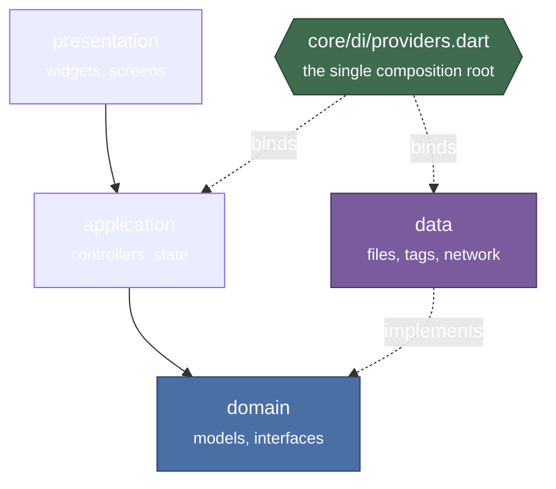
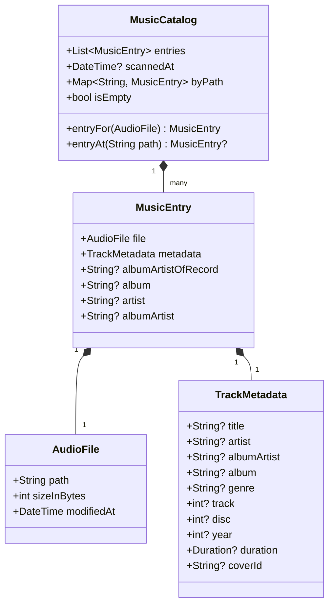
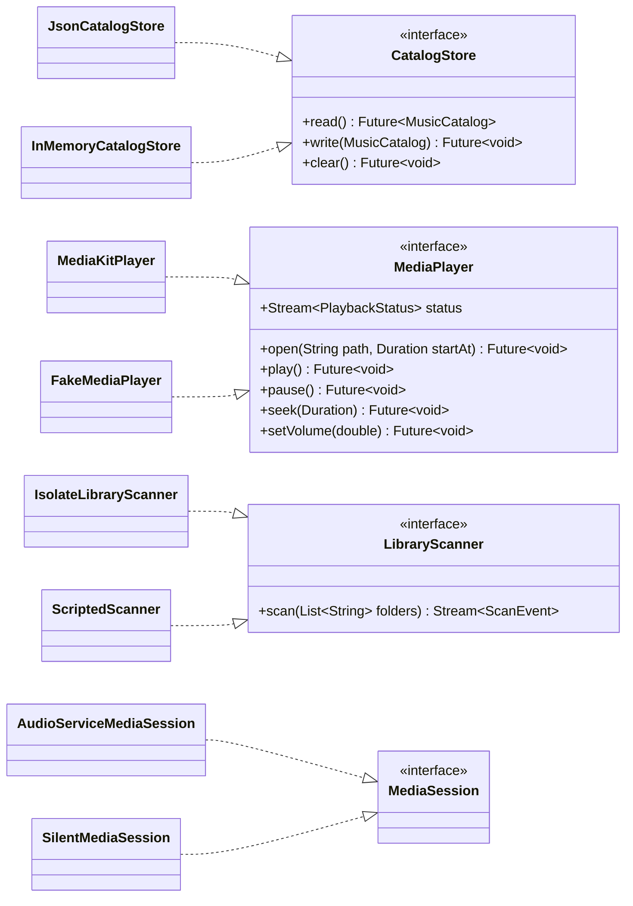

## The shape of it

Orpheus is organised by **feature**, and each feature by **layer**. There is no
`models/`, `services/`, `widgets/` split — a change to how lyrics work touches
one directory, not four.

The rule that matters: **`domain` has no Flutter and no IO.** It is models and
interfaces. `data` implements those interfaces at the outward edges — the
filesystem, the tag reader, the playback engine, the one network call. Nothing
in `domain` knows any of them exist.

That is what makes the whole test suite run without a real audio engine, a real
filesystem or a real network: every outward dependency is an interface bound in
one place, and a test overrides the binding.

### The features

| Feature | What it owns |
| --- | --- |
| `library` | Registering folders, scanning them, the catalog, cover art |
| `playback` | The queue, the engine, the player screen, the spectrum bars |
| `lyrics` | Finding a track's words, and reading along with them |
| `stats` | The play threshold, the history, and the rankings |
| `shell` | The frame: navigation, the playback bar, preferences |

## The library model

What a scan produces, and what every screen in the music area reads from.

Two things in that model are worth explaining, because both exist to fix a
real bug rather than to be tidy.

`byPath` is built once and lazily. The player asks "what is this file?" for
every track it opens and every frame the bar draws, and a linear search of the
whole library per frame is what that becomes without an index.

`albumArtistOfRecord` is how a compilation stays one record. Half-tagged
libraries are the norm, so where a file carries no album-artist tag the answer
is worked out across the whole record rather than falling through to the
performer — which is what keeps a rap album with a guest on every track out of
the artist list twelve times over.

## The outward edges

Every one of these is an interface in `domain` with an implementation in `data`
and a binding in the composition root. The right-hand column is what a test gets
instead.

`SilentMediaSession` is not only a test double. It is the honest answer on the
two desktop targets, which have no notification and no lock screen — the Android
session sits behind the same interface and is bound only there.

## The flows

- **[Finding a track's words]()** —
  the only flow that reaches a network, and the order that governs it.
- **[Scanning a library]()** — why a
  re-scan of an unchanged library is nearly free.
- **[Playing something]()** — the
  states a player can be in, including the two that are about failure.
