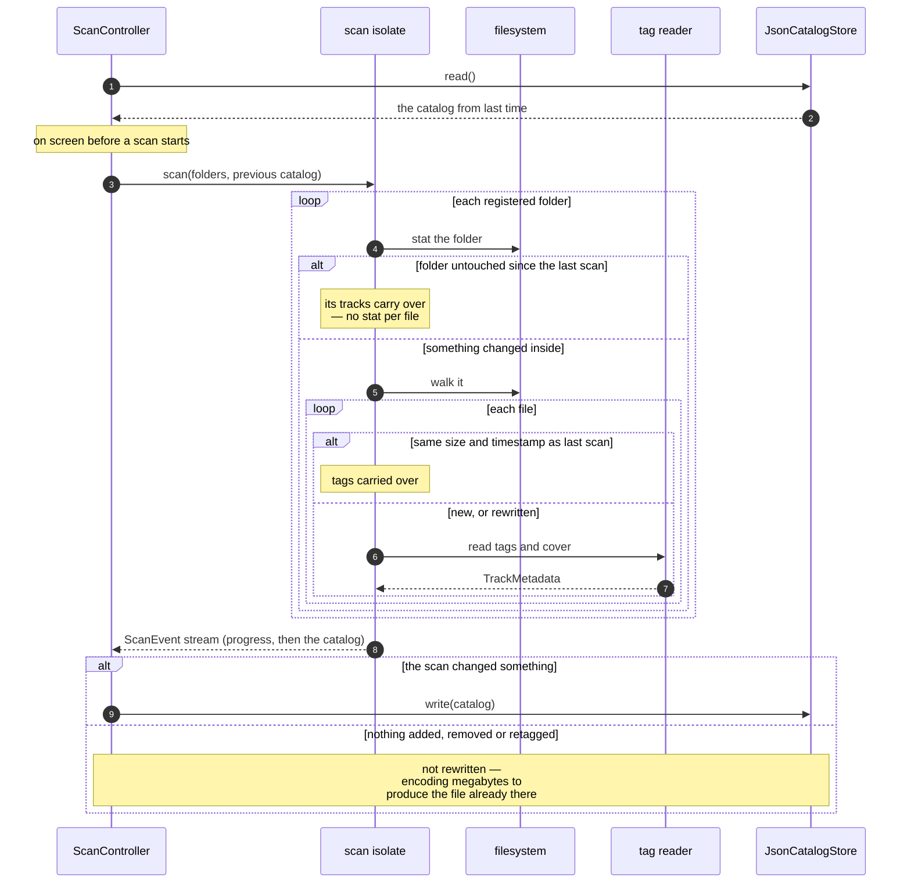

## What a scan is

A scan walks the folders the owner registered, reads the tags out of every audio
file it finds, extracts cover art, and writes the result as a single JSON
document beside the settings. That document is the library: it is read once at
launch and held in memory for the run.

Everything expensive about that is avoided wherever it can be, because on a
library of eleven thousand tracks the naive version makes every launch stutter.

## The three savings

**The catalog is not rewritten when nothing changed.** A scan that added and
removed nothing carries every entry over from the stored document, so writing it
back encodes several megabytes to produce a file identical to the one on disk.

**Encoding and decoding happen on an isolate.** This costs more work in total —
spawning is not free, and the entries are copied back — and the point is where
the work lands. The interface's isolate pays for the message rather than for the
parse, and goes on drawing through it.

**The startup scan trusts folder timestamps.** A folder whose own timestamp
predates the last scan has had nothing added, removed or renamed inside it, so
its tracks come from the catalog rather than from a `stat` each. On eleven
thousand tracks that is eleven thousand system calls not made, which on a
phone's storage is most of what the walk costs.

{}
A file rewritten *in place* changes its own timestamp and not its folder's, and
the cheap walk keeps the old tags for it. Adds, deletes and renames are still
seen, and so is a tagger that writes a temporary file and renames over the
original — which is what most of them do. The scan the owner asks for by hand
stats everything, and it is the button they press having just re-tagged
something.
{}

## Startup is never gated on a scan

The library from the last scan is on screen before a new scan is started. A
first launch shows an empty library and an invitation to add a folder; every
launch after that shows what was there last time, and the scan updates it
underneath.

## Cover art

Covers are cached by the hash of their own bytes, in a directory beside the
catalog. That makes the cache proportional to **distinct pictures** rather than
to files — a twelve-track album contributes one picture, not twelve — and it
means two records that happen to share artwork share one cached file.
