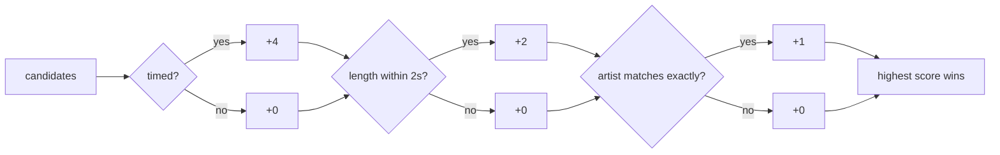

## The order is the feature

It never varies, and every part of it is a rule written down in the
specifications rather than a decision made in code:

1. **What this machine holds.** A `.lrc` beside the track, then the track's ID3
   `SYLT` frame, then its lyrics text tag. Whatever these hold is the answer,
   and nothing else is asked.
2. **Only then, a lookup** — and only if the owner has left it on.
3. **A sheet that came back is written beside the track** as a `.lrc`, so the
   next launch finds it at step 1 and asks nobody anything.

The sidecar outranks both tags deliberately: it is the one of the three an owner
can write, correct and delete with a text editor and no help from this
application. Of the two tags, the timed frame outranks the text one, because a
file carrying both was written by somebody who put the timed copy in `SYLT`.

## The flow

```mermaid
sequenceDiagram
    autonumber
    actor Owner
    participant Panel as LyricsPanel
    participant Ctrl as LyricsController
    participant Local as FileLyricsSource
    participant Remote as LrclibLyricsSource
    participant Side as FileLyricsSidecar

    Owner->>Panel: presses the lyrics control
    Panel->>Ctrl: build()

    Ctrl->>Local: of(path)
    Note over Local: .lrc beside it →<br/>SYLT frame →<br/>lyrics text tag
    alt this machine has the words
        Local-->>Ctrl: Lyrics
        Ctrl-->>Panel: Lyrics
        Note right of Ctrl: nothing is asked of anybody
    else nothing here
        Local-->>Ctrl: null
        alt the lookup is turned off
            Ctrl-->>Panel: null
            Note right of Ctrl: nothing leaves the machine
        else the lookup is on
            Ctrl->>Ctrl: build a query from the catalog
            Note over Ctrl: artist + title required;<br/>record and length if tagged
            Ctrl->>Remote: find(query)
            Remote->>Remote: exact match, with the length
            opt no exact match
                Remote->>Remote: search, then rank the candidates
            end
            alt a sheet came back
                Remote-->>Ctrl: RemoteLyrics
                Ctrl->>Side: write(path, text)
                Side-->>Ctrl: landed, or refused
                Ctrl-->>Panel: Lyrics
            else nothing found, or the network refused
                Remote-->>Ctrl: null
                Ctrl-->>Panel: null
            end
        end
    end

    Panel-->>Owner: the words, or "no lyrics for this track"
```

## What leaves, and what does not

The query carries the track's **artist and title**, with its record and length
where the tags give them. That is what is printed on the sleeve.

It does not carry the file's name, its path, the library, what else is on the
machine, or anything that persists between requests — there is no account, no
key and no identifier of any kind. The service needs none, which is why it was
the one chosen.

A track whose tags do not give **both** an artist and a title is not looked up
at all. A lookup on a title alone is a guess between every recording that shares
the name, and a file tagged that poorly is exactly the one whose words would
come back belonging to somebody else's song.

## Choosing between answers

The exact endpoint is asked first, with the length — which is what separates the
studio take from the live one, since the two share a title and an artist and
share nothing about when a line is sung.

Where that misses, a search follows, and its candidates are ranked here rather
than taken in the order they arrive:



Getting that ranking wrong is not a cosmetic failure — it puts somebody else's
words on the owner's track.

## Nothing here is ever a failure

A 404, a timeout, a captive portal, a body that is not the JSON it claimed, a
refused write: every one of them ends at the panel saying this track has no
words. That is where the owner already was, and it is not a thing they can act
on. A lookup is a convenience over a track that already had nothing.

## The sidecar

The `.lrc` written beside the track is the **only file Orpheus ever writes into
a music folder**, and the rules around it are what keep that defensible:

- One file, in the folder the track is already in. The audio file is not even
  opened.
- Never a replacement for a `.lrc` that is already there — that file is the
  owner's answer, and this only ever fills a gap.
- Written through a temporary file and renamed into place, so a process killed
  mid-write leaves either no sidecar or a whole one, never half of one the
  parser would read as truncated.
- A refusal is reported, not thrown. Read-only mounts, network shares and
  Android's scoped storage all refuse it, and none of them is a reason to
  withhold words the panel already has in hand.

On Android that refusal is the ordinary outcome rather than the exception:
scoped storage grants read access to media and nothing that would let a process
write next to the file it just read. The words show for the session; the saving
is lost.
