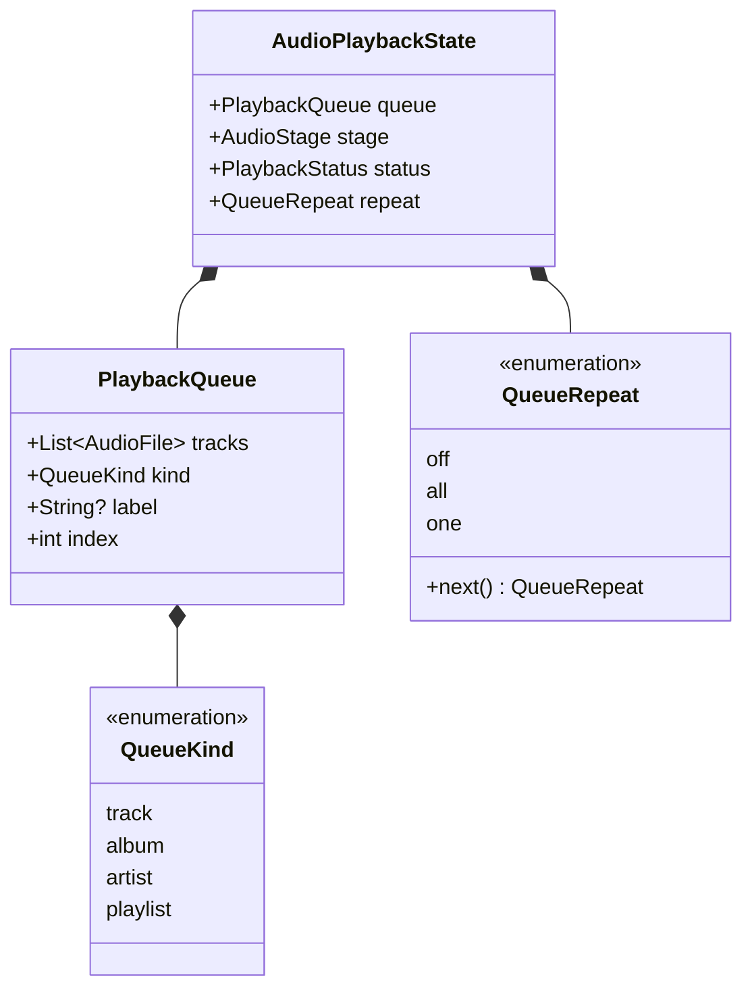
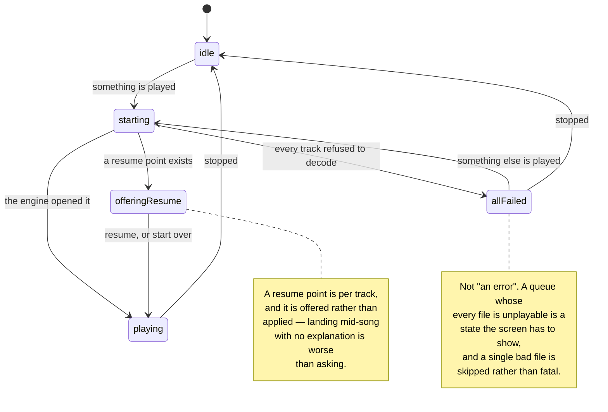
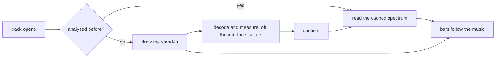

## The queue

Anything playable produces a queue: a track, a record, an artist, or the whole
library shuffled. The queue knows what kind of thing it came from, which is what
lets the player say *what* is playing rather than only which file.

`label` is carried but never worded here. The domain has no localized strings,
so what an unnamed record is *called* is a presentation decision made once, on
the way to the screen.

## The stages

The stage worth noticing is `allFailed`. A single file that will not decode is
skipped and the queue moves on — a corrupt track in the middle of a record
should not end the record. It is only when *nothing* in the queue could be
opened that the player has something to say, and then it says it rather than
sitting silently on a stopped transport.

## Position, and what it costs

The engine reports its position several times a second. Everything that follows
the music is driven from that one stream: the progress bar, the spectrum bars,
and the lyric line that is lit.

The lyric lookup for "which line is being sung at this moment" is a binary
search rather than a walk, for exactly that reason — it is asked on every
position report for as long as a track plays.

## The spectrum bars

The bars on the player are not decoration and not a random animation. They are
the spectrum of the recording, measured from its own samples by the same engine
that plays it, analysed once per track and cached against a key carrying the
file's path, length and modification time.

Until that analysis lands — the second or so after a track starts, and forever
for a file that could not be decoded — a stand-in is drawn, derived
deterministically from the track's path so it is stable rather than jittering
between frames.

## Keeping playing on Android

A foreground service is the only way Android lets a process keep making noise
once it is no longer on screen. Orpheus asks for it with the type that says what
for — `mediaPlayback` — and the notification and lock-screen controls come with
it, carrying the sleeve and the transport buttons.

Audio focus arrives through the same seam: the phone call that should pause
playback, and the headphones pulled out of the socket that should too.

Both sit behind the `MediaSession` interface, with a silent implementation bound
on the two desktops — which have no such thing, and where a silent answer is the
honest one rather than a stub.
